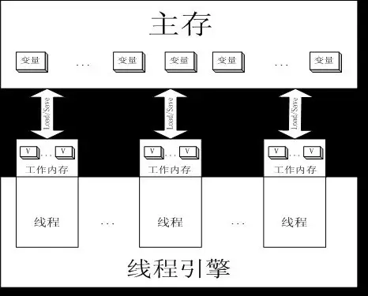

## [一.Java内存模型-JMM简介](https://mp.weixin.qq.com/s?__biz=MzA4NDc2MDQ1Nw==&mid=2650238555&idx=1&sn=48420eaa5033115c6df4425a5f80e055&chksm=87e18cbdb09605ab8ed7935245532c8a29b5a8f390c77bba3bca596f1c7556b5381b40580873&scene=21#wechat_redirect)

### 1.JMM简介

**i.内存模型概述**
   
   Java平台自动集成了线程以及多处理器技术，这种集成程度比Java以前诞生的计算机语言要厉害很多，该语言针对多种异构平台的平台独立性而使用的多线程技术支持也是具有开拓性的一面，有时候在开发Java同步和线程安全要求很严格的程序时，往往容易混淆的一个概念就是内存模型。究竟什么是内存模型？内存模型描述了程序中各个变量（实例域、静态域和数组元素）之间的关系，以及在实际计算机系统中将变量存储到内存和从内存中取出变量这样的底层细节，对象最终是存储在内存里面的，这点没有错，但是编译器、运行库、处理器或者系统缓存可以有特权在变量指定内存位置存储或者取出变量的值。【JMM】（Java Memory Model的缩写）允许编译器和缓存以数据在处理器特定的缓存（或寄存器）和主存之间移动的次序拥有重要的特权，除非程序员使用了final或synchronized明确请求了某些可见性的保证。
   
   **1)JSR133：**
   在Java语言规范里面指出了JMM是一个比较开拓性的尝试，这种尝试视图定义一个一致的、跨平台的内存模型，但是它有一些比较细微而且很重要的缺点。其实Java语言里面比较容易混淆的关键字主要是synchronized和volatile，也因为这样在开发过程中往往开发者会忽略掉这些规则，这也使得编写同步代码比较困难。
   JSR133本身的目的是为了修复原本JMM的一些缺陷而提出的，其本身的制定目标有以下几个：
   * 保留目前JVM的安全保证，以进行类型的安全检查：
   * 提供（out-of-thin-air safety）无中生有安全性，这样“正确同步的”应该被正式而且直观地定义
   * 程序员要有信心开发多线程程序，当然没有其他办法使得并发程序变得很容易开发，但是该规范的发布主要目标是为了减轻程序员理解内存模型中的一些细节负担
   * 提供大范围的流行硬件体系结构上的高性能JVM实现，现在的处理器在它们的内存模型上有着很大的不同，JMM应该能够适合于实际的尽可能多的体系结构而不以性能为代价，这也是Java跨平台型设计的基础
   * 提供一个同步的习惯用法，以允许发布一个对象使他不用同步就可见，这种情况又称为初始化安全（initialization safety）的新的安全保证
   * 对现有代码应该只有最小限度的影响

   **2)同步、异步【这里仅仅指概念上的理解，不牵涉到计算机底层基础的一些操作】:**
   
   在系统开发过程，经常会遇到这几个基本概念，不论是网络通讯、对象之间的消息通讯还是Web开发人员常用的Http请求都会遇到这样几个概念，经常有人提到Ajax是异步通讯方式，那么究竟怎样的方式是这样的概念描述呢？
   
   同步：同步就是在发出一个功能调用的时候，在没有得到响应之前，该调用就不返回，按照这样的定义，其实大部分程序的执行都是同步调用的，一般情况下，在描述同步和异步操作的时候，主要是指代需要其他部件协作处理或者需要协作响应的一些任务处理。比如有一个线程A，在A执行的过程中，可能需要B提供一些相关的执行数据，当然触发B响应的就是A向B发送一个请求或者说对B进行一个调用操作，如果A在执行该操作的时候是同步的方式，那么A就会停留在这个位置等待B给一个响应消息，在B没有任何响应消息回来的时候，A不能做其他事情，只能等待，那么这样的情况，A的操作就是一个同步的简单说明。
   
   异步：异步就是在发出一个功能调用的时候，不需要等待响应，继续进行它该做的事情，一旦得到响应了过后给予一定的处理，但是不影响正常的处理过程的一种方式。比如有一个线程A，在A执行的过程中，同样需要B提供一些相关数据或者操作，当A向B发送一个请求或者对B进行调用操作过后，A不需要继续等待，而是执行A自己应该做的事情，一旦B有了响应过后会通知A，A接受到该异步请求的响应的时候会进行相关的处理，这种情况下A的操作就是一个简单的异步操作。
   
   **3)可见性、可排序性**
   
   Java内存模型的两个关键概念：可见性（Visibility）和可排序性（Ordering）
   
   开发过多线程程序的程序员都明白，synchronized关键字强制实施一个线程之间的互斥锁（相互排斥），该互斥锁防止每次有多个线程进入一个给定监控器所保护的同步语句块，也就是说在该情况下，执行程序代码所独有的某些内存是独占模式，其他的线程是不能针对它执行过程所独占的内存进行访问的，这种情况称为该内存不可见。但是在该模型的同步模式中，还有另外一个方面：JMM中指出了，JVM在处理该强制实施的时候可以提供一些内存的可见规则，在该规则里面，它确保当存在一个同步块时，缓存被更新，当输入一个同步块时，缓存失效。因此在JVM内部提供给定监控器保护的同步块之中，一个线程所写入的值对于其余所有的执行由同一个监控器保护的同步块线程来说是可见的，这就是一个简单的可见性的描述。这种机器保证编译器不会把指令从一个同步块的内部移到外部，虽然有时候它会把指令由外部移动到内部。JMM在缺省情况下不做这样的保证——只要有多个线程访问相同变量时必须使用同步。简单总结：
   
   可见性就是在多核或者多线程运行过程中内存的一种共享模式，在JMM模型里面，通过并发线程修改变量值的时候，必须将线程变量同步回主存过后，其他线程才可能访问到。
   
   简单讲，内存的可见性使内存资源可以共享，当一个线程执行的时候它所占有的内存，如果它占有的内存资源是可见的，那么这时候其他线程在一定规则内是可以访问该内存资源的，这种规则是由JMM内部定义的，这种情况下内存的该特性称为其可见性。
   
   可排序性提供了内存内部的访问顺序，在不同的程序针对不同的内存块进行访问的时候，其访问不是无序的，比如有一个内存块，A和B需要访问的时候，JMM会提供一定的内存分配策略有序地分配它们使用的内存，而在内存的调用过程也会变得有序地进行，内存的折中性质可以简单理解为有序性。而在Java多线程程序里面，JMM通过Java关键字volatile来保证内存的有序访问。
   
   
**ii.JMM结构：**

   **1)简单分析：**
   
   Java语言规范中提到过，JVM中存在一个主存区（Main Memory或Java Heap Memory），Java中所有变量都是存在主存中的，对于所有线程进行共享，而每个线程又存在自己的工作内存（Working Memory），工作内存中保存的是主存中某些变量的拷贝，线程对所有变量的操作并非发生在主存区，而是发生在工作内存中，而线程之间是不能直接相互访问，变量在程序中的传递，是依赖主存来完成的。而在多核处理器下，大部分数据存储在高速缓存中，如果高速缓存不经过内存的时候，也是不可见的一种表现。在Java程序中，内存本身是比较昂贵的资源，其实不仅仅针对Java应用程序，对操作系统本身而言内存也属于昂贵资源，Java程序在性能开销过程中有几个比较典型的可控制的来源。synchronized和volatile关键字提供的内存中模型的可见性保证程序使用一个特殊的、存储关卡（memory barrier）的指令，来刷新缓存，使缓存无效，刷新硬件的写缓存并且延迟执行的传递过程，无疑该机制会对Java程序的性能产生一定的影响。
   


   JMM的最初目的，就是为了能够支持多线程程序设计的，每个线程可以认为是和其他线程不同的CPU上运行，或者对于多处理器的机器而言，该模型需要实现的就是使得每一个线程就像运行在不同的机器、不同的CPU或者本身就不同的线程上一样，这种情况实际上在项目开发中是常见的。对于CPU本身而言，不能直接访问其他CPU的寄存器，模型必须通过某种定义规则来使得线程和线程在工作内存中进行相互调用而实现CPU本身对其他CPU、或者说线程对其他线程的内存中资源的访问，而表现这种规则的运行环境一般为运行该程序的运行宿主环境（操作系统、服务器、分布式系统等），而程序本身表现就依赖于编写该程序的语言特性，这里也就是说用Java编写的应用程序在内存管理中的实现就是遵循其部分原则，也就是前边提及到的JMM定义了Java语言针对内存的一些的相关规则。
   然而，虽然设计之初是为了能够更好支持多线程，但是该模型的应用和实现当然不局限于多处理器，而在JVM编译器编译Java编写的程序的时候以及运行期执行该程序的时候，对于单CPU的系统而言，这种规则也是有效的，这就是是上边提到的线程和线程之间的内存策略。JMM本身在描述过程没有提过具体的内存地址以及在实现该策略中的实现方法是由JVM的哪一个环节（编译器、处理器、缓存控制器、其他）提供的机制来实现的，甚至针对一个开发非常熟悉的程序员，也不一定能够了解它内部对于类、对象、方法以及相关内容的一些具体可见的物理结构。
   相反，JMM定义了一个线程与主存之间的抽象关系，其实从上边的图可以知道，每一个线程可以抽象成为一个工作内存（抽象的高速缓存和寄存器），其中存储了Java的一些值，该模型保证了Java里面的属性、方法、字段存在一定的数学特性，按照该特性，该模型存储了对应的一些内容，并且针对这些内容进行了一定的序列化以及存储排序操作，这样使得Java对象在工作内存里面被JVM顺利调用，（当然这是比较抽象的一种解释）既然如此，大多数JMM的规则在实现的时候，必须使得主存和工作内存之间的通信能够得以保证，而且不能违反内存模型本身的结构，这是语言在设计之处必须考虑到的针对内存的一种设计方法。
   这里需要知道的一点是，这一切的操作在Java语言里面都是依靠Java语言自身来操作的，因为Java针对开发人员而言，内存的管理在不需要手动操作的情况下本身存在内存的管理策略，这也是Java自己进行内存管理的一种优势。
   
**[1]原子性（Atomicity）：**

   这一点说明了该模型定义的规则针对原子级别的内容存在独立的影响，对于模型设计最初，这些规则需要说明的仅仅是最简单的读取和存储单元写入的的一些操作，这种原子级别的包括——实例、静态变量、数组元素，只是在该规则中不包括方法中的局部变量。
   
**[2]可见性（Visibility）：**

   在该规则的约束下，定义了一个线程在哪种情况下可以访问另外一个线程或者影响另外一个线程，从JVM的操作上讲包括了从另外一个线程的可见区域读取相关数据以及将数据写入到另外一个线程内。
   
**[3]可排序性（Ordering）：**

   该规则将会约束任何一个违背了规则调用的线程在操作过程中的一些顺序，排序问题主要围绕了读取、写入和赋值语句有关的序列。
   
   如果在该模型内部使用了一致的同步性的时候，这些属性中的每一个属性都遵循比较简单的原则：和所有同步的内存块一样，每个同步块之内的任何变化都具备了原子性以及可见性，和其他同步方法以及同步块遵循同样一致的原则，而且在这样的一个模型内，每个同步块不能使用同一个锁，在整个程序的调用过程是按照编写的程序指定指令运行的。即使某一个同步块内的处理可能会失效，但是该问题不会影响到其他线程的同步问题，也不会引起连环失效。简单讲：当程序运行的时候使用了一致的同步性的时候，每个同步块有一个独立的空间以及独立的同步控制器和锁机制，然后对外按照JVM的执行指令进行数据的读写操作。这种情况使得使用内存的过程变得非常严谨！
   
   如果不使用同步或者说使用同步不一致（这里可以理解为异步，但不一定是异步操作），该程序执行的答案就会变得极其复杂。而且在这样的情况下，该内存模型处理的结果比起大多数程序员所期望的结果而言就变得十分脆弱，甚至比起JVM提供的实现都脆弱很多。因为这样所以出现了Java针对该内存操作的最简单的语言规范来进行一定的习惯限制，排除该情况发生的做法在于：
   
   JVM线程必须依靠自身来维持对象的可见性以及对象自身应该提供相对应的操作而实现整个内存操作的三个特性，而不是仅仅依靠特定的修改对象状态的线程来完成如此复杂的一个流程。
   
   【*：综上所属，JMM在JVM内部实现的结构就变得相对复杂，当然一般的Java初学者可以不用了解得这么深入。】
   

**[4]三个特性的解析（针对JMM内部）：**

* 原子性（Atomicity）：

   访问存储单元内的任何类型的字段的值以及对其更新操作的时候，除开long类型和double类型，其他类型的字段是必须要保证其原子性的，这些字段也包括为对象服务的引用。此外，该原子性规则扩展可以延伸到基于long和double的另外两种类型：volatile long和volatile double（volatile为java关键字），没有被volatile声明的long类型以及double类型的字段值虽然不保证其JMM中的原子性，但是是被允许的。针对non-long/non-double的字段在表达式中使用的时候，JMM的原子性有这样一种规则：如果你获得或者初始化该值或某一些值的时候，这些值是由其他线程写入，而且不是从两个或者多个线程产生的数据在同一时间戳混合写入的时候，该字段的原子性在JVM内部是必须得到保证的。也就是说JMM在定义JVM原子性的时候，只要在该规则不违反的条件下，JVM本身不去理睬该数据的值是来自于什么线程，因为这样使得Java语言在并行运算的设计的过程中针对多线程的原子性设计变得极其简单，而且即使开发人员没有考虑到最终的程序也没有太大的影响。再次解释一下：这里的原子性指的是原子级别的操作，比如最小的一块内存的读写操作，可以理解为Java语言最终编译过后最接近内存的最底层的操作单元，这种读写操作的数据单元不是变量的值，而是本机码，也就是前边在讲《Java基础知识》中提到的由运行器解释的时候生成的Native Code。
   
* 可见性（Visibility）：
   
   当一个线程需要修改另外线程的可见单元的时候必须遵循以下原则：
   
   1、一个写入线程释放的同步锁和紧随其后进行读取的读线程的同步锁是同一个从本质上讲，释放锁操作强迫它的隶属线程【释放锁的线程】从工作内存中的写入缓存里面刷新（专业上讲这里不应该是刷新，可以理解为提供）数据（flush操作），然后获取锁操作使得另外一个线程【获得锁的线程】直接读取前一个线程可访问域（也就是可见区域）的字段的值。因为该锁内部提供了一个同步方法或者同步块，该同步内容具有线程排他性，这样就使得上边两个操作只能针对单一线程在同步内容内部进行操作，这样就使得所有操作该内容的单一线程具有该同步内容（加锁的同步方法或者同步块）内的线程排他性，这种情况的交替也可以理解为具有“短暂记忆效应”。
   
   2、这里需要理解的是同步的双重含义：使用锁机制允许基于高层同步协议进行处理操作，这是最基本的同步；同时系统内存（很多时候这里是指基于机器指令的底层存储关卡memory barrier，前边提到过）在处理同步的时候能够跨线程操作，使得线程和线程之间的数据是同步的。这样的机制也折射出一点，并行编程相对于顺序编程而言，更加类似于分布式编程。后一种同步可以作为JMM机制中的方法在一个线程中运行的效果展示，注意这里不是多个线程运行的效果展示，因为它反应了该线程愿意发送或者接受的双重操作，并且使得它自己的可见区域可以提供给其他线程运行或者更新，从这个角度来看，使用锁和消息传递可以视为相互之间的变量同步，因为相对其他线程而言，它的操作针对其他线程也是对等的。

   3、一旦某个字段被申明为volatile，在任何一个写入线程在工作内存中刷新缓存的之前需要进行进一步的内存操作，也就是说针对这样的字段进行立即刷新，可以理解为这种volatile不会出现一般变量的缓存操作，而读取线程每次必须根据前一个线程的可见域里面重新读取该变量的值，而不是直接读取。
   
   4、当某个线程第一次去访问某个对象的域的时候，它要么初始化该对象的值，要么从其他写入线程可见域里面去读取该对象的值；这里结合上边理解，在满足某种条件下，该线程对某对象域的值的读取是直接读取，有些时候却需要重新读取。
   
   这里需要小心一点的是，在并发编程里面，不好的一个实践就是使用一个合法引用去引用不完全构造的对象，这种情况在从其他写入线程可见域里面进行数据读取的时候发生频率比较高。从编程角度上讲，在构造函数里面开启一个新的线程是有一定的风险的，特别是该类是属于一个可子类化的类的时候。Thread.start由调用线程启动，然后由获得该启动的线程释放锁具有相同的“短暂记忆效应”，如果一个实现了Runnable接口的超类在子类构造子执行之前调用了Thread(this).start()方法，那么就可能使得该对象在线程方法run执行之前并没有被完全初始化，这样就使得一个指向该对象的合法引用去引用了不完全构造的一个对象。同样的，如果创建一个新的线程T并且启动该线程，然后再使用线程T来创建对象X，这种情况就不能保证X对象里面所有的属性针对线程T都是可见的除非是在所有针对X对象的引用中进行同步处理，或者最好的方法是在T线程启动之前创建对象X。
   
   5、若一个线程终止，所有的变量值都必须从工作内存中刷到主存，比如，如果一个同步线程因为另一个使用Thread.join方法的线程而终止，那么该线程的可见域针对那个线程而言其发生的改变以及产生的一些影响是需要保证可知道的。
   
   注意：如果在同一个线程里面通过方法调用去传一个对象的引用是绝对不会出现上边提及到的可见性问题的。JMM保证所有上边的规定以及关于内存可见性特性的描述——一个特殊的更新、一个特定字段的修改都是某个线程针对其他线程的一个“可见性”的概念，最终它发生的场所在内存模型中Java线程和线程之间，至于这个发生时间可以是一个任意长的时间，但是最终会发生，也就是说，Java内存模型中的可见性的特性主要是针对线程和线程之间使用内存的一种规则和约定，该约定由JMM定义。
   
   不仅仅如此，该模型还允许不同步的情况下可见性特性。比如针对一个线程提供一个对象或者字段访问域的原始值进行操作，而针对另外一个线程提供一个对象或者字段刷新过后的值进行操作。同样也有可能针对一个线程读取一个原始的值以及引用对象的对象内容，针对另外一个线程读取一个刷新过后的值或者刷新过后的引用。
   
   尽管如此，上边的可见性特性分析的一些特征在跨线程操作的时候是有可能失败的，而且不能够避免这些故障发生。这是一个不争的事实，使用同步多线程的代码并不能绝对保证线程安全的行为，只是允许某种规则对其操作进行一定的限制，但是在最新的JVM实现以及最新的Java平台中，即使是多个处理器，通过一些工具进行可见性的测试发现其实是很少发生故障的。跨线程共享CPU的共享缓存的使用，其缺陷就在于影响了编译器的优化操作，这也体现了强有力的缓存一致性使得硬件的价值有所提升，因为它们之间的关系在线程与线程之间的复杂度变得更高。这种方式使得可见度的自由测试显得更加不切实际，因为这些错误的发生极为罕见，或者说在平台上我们开发过程中根本碰不到。在并行程开发中，不使用同步导致失败的原因也不仅仅是对可见度的不良把握导致的，导致其程序失败的原因是多方面的，包括缓存一致性、内存一致性问题等。
   
   
* 可排序性（Ordering）：

   可排序规则在线程与线程之间主要有下边两点：
   * 从操作线程的角度看来，如果所有的指令执行都是按照普通顺序进行，那么对于一个顺序运行的程序而言，可排序性也是顺序的
   * 从其他操作线程的角度看来，排序性如同在这个线程中运行在非同步方法中的一个“间谍”，所以任何事情都有可能发生。唯一有用的限制是同步方法和同步块的相对排序，就像操作volatile字段一样，总是保留下来使用
   
   【*：如何理解这里“间谍”的意思，可以这样理解，排序规则在本线程里面遵循了第一条法则，但是对其他线程而言，某个线程自身的排序特性可能使得它不定地访问执行线程的可见域，而使得该线程对本身在执行的线程产生一定的影响。举个例子，A线程需要做三件事情分别是A1、A2、A3，而B是另外一个线程具有操作B1、B2，如果把参考定位到B线程，那么对A线程而言，B的操作B1、B2有可能随时会访问到A的可见区域，比如A有一个可见区域a，A1就是把a修改称为1，但是B线程在A线程调用了A1过后，却访问了a并且使用B1或者B2操作使得a发生了改变，变成了2，那么当A按照排序性进行A2操作读取到a的值的时候，读取到的是2而不是1，这样就使得程序最初设计的时候A线程的初衷发生了改变，就是排序被打乱了，那么B线程对A线程而言，其身份就是“间谍”，而且需要注意到一点，B线程的这些操作不会和A之间存在等待关系，那么B线程的这些操作就是异步操作，所以针对执行线程A而言，B的身份就是“非同步方法中的‘间谍’。】
   
   同样的，这仅仅是一个最低限度的保障性质，在任何给定的程序或者平台，开发中有可能发现更加严格的排序，但是开发人员在设计程序的时候不能依赖这种排序，如果依赖它们会发现测试难度会成指数级递增，而且在复合规定的时候会因为不同的特性使得JVM的实现因为不符合设计初衷而失败。
   
   注意：第一点在JLS（Java Language Specification）的所有讨论中也是被采用的，例如算数表达式一般情况都是从上到下、从左到右的顺序，但是这一点需要理解的是，从其他操作线程的角度看来这一点又具有不确定性，对线程内部而言，其内存模型本身是存在排序性的。【*：这里讨论的排序是最底层的内存里面执行的时候的NativeCode的排序，不是说按照顺序执行的Java代码具有的有序性质，本文主要分析的是JVM的内存模型，所以希望读者明白这里指代的讨论单元是内存区。】
   
 
**iii.原始JMM缺陷：**

   JMM最初设计的时候存在一定的缺陷，这种缺陷虽然现有的JVM平台已经修复，但是这里不得不提及，也是为了读者更加了解JMM的设计思路。
   
**1) 问题1：不可变对象不是不可变的** 

   学过Java的朋友都应该知道Java中的不可变对象，这一点在本文最后讲解String类的时候也会提及，而JMM最初设计的时候，这个问题一直都存在，就是：不可变对象似乎可以改变它们的值（这种对象的不可变指通过使用final关键字来得到保证），（Publis Service Reminder：让一个对象的所有字段都为final并不一定使得这个对象不可变——所有类型还必须是原始类型而不能是对象的引用。而不可变对象被认为不要求同步的。但是，因为在将内存写方面的更改从一个线程传播到另外一个线程的时候存在潜在的延迟，这样就使得有可能存在一种竞态条件，即允许一个线程首先看到不可变对象的一个值，一段时间之后看到的是一个不同的值。这种情况以前怎么发生的呢？在JDK 1.4中的String实现里，这儿基本有三个重要的决定性字段：对字符数组的引用、长度和描述字符串的开始数组的偏移量。String就是以这样的方式在JDK 1.4中实现的，而不是只有字符数组，因此字符数组可以在多个String和StringBuffer对象之间共享，而不需要在每次创建一个String的时候都拷贝到一个新的字符数组里。假设有下边的代码：
  
```
String s1 = "/usr/tmp";
String s2 = s1.substring(4); // "/tmp"
```

   这种情况下，字符串s2将具有大小为4的长度和偏移量，但是它将和s1共享“/usr/tmp”里面的同一字符数组，在String构造函数运行之前，Object的构造函数将用它们默认的值初始化所有的字段，包括决定性的长度和偏移字段。当String构造函数运行的时候，字符串长度和偏移量被设置成所需要的值。但是在旧的内存模型中，因为缺乏同步，有可能另一个线程会临时地看到偏移量字段具有初始默认值0，而后又看到正确的值4，结果是s2的值从“/usr”变成了“/tmp”，这并不是我们真正的初衷，这个问题就是原始JMM的第一个缺陷所在，因为在原始JMM模型里面这是合理而且合法的，JDK 1.4以下的版本都允许这样做。
   
**2)问题2：重新排序的易失性和非易失性存储**

   另一个主要领域是与volatile字段的内存操作重新排序有关，这个领域中现有的JMM引起了一些比较混乱的结果。现有的JMM表明易失性的读和写是直接和主存打交道的，这样避免了把值存储到寄存器或者绕过处理器特定的缓存，这使得多个线程一般能看见一个给定变量最新的值。可是，结果是这种volatile定义并没有最初想象中那样如愿以偿，并且导致了volatile的重大混乱。为了在缺乏同步的情况下提供较好的性能，编译器、运行时和缓存通常是允许进行内存的重新排序操作的，只要当前执行的线程分辨不出它们的区别。（这就是within-thread as-if-serial semantics[线程内似乎是串行]的解释）但是，易失性的读和写是完全跨线程安排的，编译器或缓存不能在彼此之间重新排序易失性的读和写。遗憾的是，通过参考普通变量的读写，JMM允许易失性的读和写被重排序，这样以为着开发人员不能使用易失性标志作为操作已经完成的标志。比如：

```
Map configOptions;

char[] configText;

volatile boolean initialized = false;

// 线程1

configOptions = new HashMap();

configText = readConfigFile(filename);

processConfigOptions(configText,configOptions);

initialized = true;

 

// 线程2

while(!initialized)

    sleep();
```
  
   这里的思想是使用易失性变量initialized担任守卫来表明一套别的操作已经完成了，这是一个很好的思想，但是不能在JMM下工作，因为旧的JMM允许非易失性的写（比如写到configOptions字段，以及写到由configOptions引用Map的字段中）与易失性的写一起重新排序，因此另外一个线程可能会看到initialized为true，但是对于configOptions字段或它所引用的对象还没有一个一致的或者说当前的针对内存的视图变量，volatile的旧语义只承诺在读和写的变量的可见性，而不承诺其他变量，虽然这种方法更加有效的实现，但是结果会和我们设计之初大相径庭。
   
   


## [二.Java内存模型-堆和栈](https://mp.weixin.qq.com/s?__biz=MzA4NDc2MDQ1Nw==&mid=2650238555&idx=2&sn=2e8f8f11cc8206baafa71520784baa96&chksm=87e18cbdb09605ab0a64f615644252a6d09cbc33a02a04919e236534285a0a60584349d8990b&scene=21#wechat_redirect)

### 1.Java内存管理简介：

   内存管理在Java语言中是JVM自动操作的，当JVM发现某些对象不再需要的时候，就会对该对象占用的内存进行重分配（释放）操作，而且使得分配出来的内存能够提供给所需要的对象。
   
   在一些编程语言里面，内存管理是一个程序的职责，但是书写过C++的程序员很清楚，如果该程序需要自己来书写很有可能引起很严重的错误或者说不可预料的程序行为，最终大部分开发时间都花在了调试这种程序以及修复相关错误上。一般情况下在Java程序开发过程把手动内存管理称为显示内存管理，而显示内存管理经常发生的一个情况就是引用悬挂——也就是说有可能在重新分配过程释放掉了一个被某个对象引用正在使用的内存空间，释放掉该空间过后，该引用就处于悬挂状态。如果这个被悬挂引用指向的对象试图进行原来对象（因为这个时候该对象有可能已经不存在了）进行操作的时候，由于该对象本身的内存空间已经被手动释放掉了，这个结果是不可预知的。
   
   显示内存管理另外一个常见的情况是内存泄漏，当某些引用不再引用该内存对象的时候，而该对象原本占用的内存并没有被释放，这种情况简言为内存泄漏。比如，如果针对某个链表进行了内存分配，而因为手动分配不当，仅仅让引用指向了某个元素所处的内存空间，这样就使得其他链表中的元素不能再被引用而且使得这些元素所处的内存让应用程序处于不可达状态而且这些对象所占有的内存也不能够被再使用，这个时候就发生了内存泄漏。而这种情况一旦在程序中发生，就会一直消耗系统的可用内存直到可用内存耗尽，而针对计算机而言内存泄漏的严重程度大了会使得本来正常运行的程序直接因为内存不足而中断，并不是Java程序里面出现Exception那么轻量级。
   
   在以前的编程过程中，手动内存管理带了计算机程序不可避免的错误，而且这种错误对计算机程序是毁灭性的，所以内存管理就成为了一个很重要的话题，但是针对大多数纯面向对象语言而言，比如Java，提供了语言本身具有的内存特性：自动化内存管理，这种语言提供了一个程序垃圾回收器（Garbage Collector[GC]），自动内存管理提供了一个抽象的接口以及更加可靠的代码使得内存能够在程序里面进行合理的分配。最常见的情况就是垃圾回收器避免了悬挂引用的问题，因为一旦这些对象没有被任何引用“可达”的时候，也就是这些对象在JVM的内存池里面成为了不可引用对象，该垃圾回收器会直接回收掉这些对象占用的内存，当然这些对象必须满足垃圾回收器回收的某些对象规则，而垃圾回收器在回收的时候会自动释放掉这些内存。不仅仅如此，垃圾回收器同样会解决内存泄漏问题。


### 2.详解堆和栈[图片以及部分内容来自《Inside JVM》]：

**1)通用简介**

[编译原理]学过编译原理的人都明白，程序运行时有三种内存分配策略：静态的、栈式的、堆式的

   静态存储——是指在编译时就能够确定每个数据目标在运行时的存储空间需求，因而在编译时就可以给它们分配固定的内存空间。这种分配策略要求程序代码中不允许有可变数据结构的存在，也不允许有嵌套或者递归的结构出现，因为它们都会导致编译程序无法计算准确的存储空间。
   
   栈式存储——该分配可成为动态存储分配，是由一个类似于堆栈的运行栈来实现的，和静态存储的分配方式相反，在栈式存储方案中，程序对数据区的需求在编译时是完全未知的，只有到了运行的时候才能知道，但是规定在运行中进入一个程序模块的时候，必须知道该程序模块所需要的数据区的大小才能分配其内存。和我们在数据结构中所熟知的栈一样，栈式存储分配按照先进后出的原则进行分配。
   
   堆式存储——堆式存储分配则专门负责在编译时或运行时模块入口处都无法确定存储要求的数据结构的内存分配，比如可变长度串和对象实例，堆由大片的可利用块或空闲块组成，堆中的内存可以按照任意顺序分配和释放。
   


**2)JVM结构【堆、栈解析】**

   在Java虚拟机规范中，一个虚拟机实例的行为主要描述为：子系统、内存区域、数据类型和指令，这些组件在描述了抽象的JVM内部的一个抽象结构。与其说这些组成部分的目的是进行JVM内部结构的一种支配，更多的是提供一种严格定义实现的外部行为，该规范定义了这些抽象组成部分以及相互作用的任何Java虚拟机执行所需要的行为。下图描述了JVM内部的一个结构，其中主要包括主要的子系统、内存区域，如同以前在《Java基础知识》中描述的：Java虚拟机有一个类加载器作为JVM的子系统，类加载器针对Class进行检测以鉴定完全合格的类接口，而JVM内部也有一个执行引擎.
   
   
   当JVM运行一个程序的时候，它的内存需要用来存储很多内容，包括字节码、以及从类文件中提取出来的一些附加信息、以及程序中实例化的对象、方法参数、返回值、局部变量以及计算的中间结果。
   
   JVM的内存组织需要在不同的运行时数据区进行以上的几个操作，下边针对上图里面出现的几个运行时数据区进行详细解析：一些运行时数据区共享了所有应用程序线程和其他特有的单个线程，每个JVM实例有一个方法区和一个内存堆，这些是共同在虚拟机内运行的线程。在Java程序里面，每个新的线程启动过后，它就会被JVM在内部分配自己的PC寄存器[PC registers]（程序计数器器）和Java堆栈（Java stacks）。
   
   若该线程正在执行一个非本地Java方法，在PC寄存器的值指示下一条指令执行，该线程在Java内存栈中保存了非本地Java方法调用状态，其状态包括局部变量、被调用的参数、它的返回值、以及中间计算结果。而本地方法调用的状态则是存储在独立的本地方法内存栈里面（native method stacks），这种情况下使得这些本地方法和其他内存运行时数据区的内容尽可能保证和其他内存运行时数据区独立，而且该方法的调用更靠近操作系统，这些方法执行的字节码有可能根据操作系统环境的不同使得其编译出来的本地字节码的结构也有一定的差异。
   
   JVM中的内存栈是一个栈帧的组合，一个栈帧包含了某个Java方法调用的状态，当某个线程调用方法的时候，JVM就会将一个新的帧压入到Java内存栈，当方法调用完成过后，JVM将会从内存栈中移除该栈帧。JVM里面不存在一个可以存放中间计算数据结果值的寄存器，其内部指令集使用Java栈空间来存储中间计算的数据结果值，这种做法的设计是为了保持Java虚拟机的指令集紧凑，使得与寄存器原理能够紧密结合并且进行操作。
