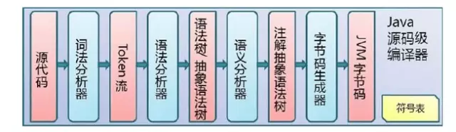

# JVM核心知识


## 一. [JVM基本结构](https://mp.weixin.qq.com/s?__biz=MzA4NDc2MDQ1Nw==&mid=2650238256&idx=1&sn=bd468f38dde837768d2b4578bfbd248a&chksm=87e18fd6b09606c0f8af4b2e6ddf70984d57c8fbf28b640d278093a41a964a4509de9b4d11f5&scene=21#wechat_redirect)

### 1. 什么是Java虚拟机，什么是Java的虚拟机实例？

java的虚拟机相当于我们的一个java类，而java虚拟机实例，相当我们new一个java类，不过java虚拟机不是通过new这个关键字而是通过java.exe或者javaw.exe来启动一个虚拟机实例。

### 2. JVM的生命周期

java虚拟机的生命周期，当一个java应用main函数启动时虚拟机也同时被启动，而只有当在虚拟机实例中的所有非守护进程都结束时，java虚拟机实例才结束生命。

### 3. Java虚拟机的体系结构

* 1、Heap(堆)：一个Java虚拟实例中只存在一个堆空间
* 2、MethodArea(方法区域)：被装载的class的信息存储在Methodarea的内存中。当虚拟机装载某个类型时，它使用类装载器定位相应的class文件，然后读入这个class文件内容并把它传输到虚拟机中。
* 3、JavaStack(java的栈)：虚拟机只会直接对Javastack执行两种操作：以帧为单位的压栈或出栈
* 4、ProgramCounter(程序计数器)：每一个线程都有它自己的PC寄存器，也是该线程启动时创建的。PC寄存器的内容总是指向下一条将被执行指令的饿地址，这里的地址可以是一个本地指针，也可以是在方法区中相对应于该方法起始指令的偏移量。
* 5、Nativemethodstack(本地方法栈)：保存native方法进入区域的地址


## 二. [Java中JVM的原理](https://mp.weixin.qq.com/s?__biz=MzA4NDc2MDQ1Nw==&mid=2650238250&idx=1&sn=6347a318fccd8060838bda7d49735e69&chksm=87e18fccb09606da0abcc186355816d3970a1db85058d55de61c58c008b943158a527c4db865&scene=21#wechat_redirect)

对于JVM的学习，在我看来这么几个部分最重要：Java代码编译和执行的整个过程,JVM内存管理及垃圾回收机制

### 1. Java代码编译和执行的整个过程

Java代码编译是由Java源码编译器来完成，流程图如下所示：


Java字节码的执行是由JVM执行引擎来完成，流程图如下所示：


Java代码编译和执行的整个过程包含了以下三个重要的机制：Java源码编译机制、类加载机制、类执行机制


**1.Java源码编译机制**

Java源码编译由以下三个过程组成：（javac –verbose  输出有关编译器正在执行的操作的消息） 分析和输入到符号表、注解处理、语义分析和生成class文件


最后生成的class文件由以下部分组成：

* 结构信息。包括class文件格式版本号及各部分的数量与大小的信息
* 元数据。对应于Java源码中声明与常量的信息。包含类/继承的超类/实现的接口的声明信息、域与方法声明信息和常量池
* 方法信息。对应Java源码中语句和表达式对应的信息。包含字节码、异常处理器表、求值栈与局部变量区大小、求值栈的类型记录、调试符号信息


**2.类加载机制**
JVM的类加载是通过ClassLoader及其子类来完成的，类的层次关系和加载顺序可以由下图来描述：


* 1）Bootstrap ClassLoader /启动类加载器

$JAVA_HOME中jre/lib/rt.jar里所有的class，由C++实现，不是ClassLoader子类

 

* 2）Extension ClassLoader/扩展类加载器

负责加载java平台中扩展功能的一些jar包，包括$JAVA_HOME中jre/lib/*.jar或-Djava.ext.dirs指定目录下的jar包


* 3）App ClassLoader/ 系统类加载器

负责记载classpath中指定的jar包及目录中class


* 4）Custom ClassLoader/用户自定义类加载器(java.lang.ClassLoader的子类)

加载过程中会先检查类是否被已加载，检查顺序是自底向上，从Custom ClassLoader到BootStrap ClassLoader逐层检查，只要某个classloader已加载就视为已加载此类，保证此类只所有ClassLoader加载一次。而加载的顺序是自顶向下，也就是由上层来逐层尝试加载此类。

**类加载双亲委派机制介绍和分析**

在这里，需要着重说明的是，JVM在加载类时默认采用的是双亲委派机制。通俗的讲，就是某个特定的类加载器在接到加载类的请求时，首先将加载任务委托给父类加载器，依次递归，如果父类加载器可以完成类加载任务，就成功返回；只有父类加载器无法完成此加载任务时，才自己去加载。


**3.类执行机制**
JVM是基于栈的体系结构来执行class字节码的。线程创建后，都会产生程序计数器（PC）和栈（Stack），程序计数器存放下一条要执行的指令在方法内的偏移量，栈中存放一个个栈帧，每个栈帧对应着每个方法的每次调用，而栈帧又是有局部变量区和操作数栈两部分组成，局部变量区用于存放方法中的局部变量和参数，操作数栈中用于存放方法执行过程中产生的中间结果。


### 2.JVM内存管理及垃圾回收机制

Sun的JVMGenerationalCollecting(垃圾回收)原理是这样的：把对象分为年青代(Young)、年老代(Tenured)、持久代(Perm)，对不同生命周期的对象使用不同的算法。(基于对对象生命周期分析)


**1.Young（年轻代）**

年轻代分三个区。一个Eden区，两个Survivor区。大部分对象在Eden区中生成。当Eden区满时，还存活的对象将被复制到Survivor区（两个中的一个），当这个Survivor区满时，此区的存活对象将被复制到另外一个Survivor区，当这个Survivor去也满了的时候，从第一个Survivor区复制过来的并且此时还存活的对象，将被复制年老区(Tenured。需要注意，Survivor的两个区是对称的，没先后关系，所以同一个区中可能同时存在从Eden复制过来对象，和从前一个Survivor复制过来的对象，而复制到年老区的只有从第一个Survivor去过来的对象。而且，Survivor区总有一个是空的。

**2.Tenured（年老代）**

年老代存放从年轻代存活的对象。一般来说年老代存放的都是生命期较长的对象。

**3.Perm（持久代）**

用于存放静态文件，如今Java类、方法等。持久代对垃圾回收没有显著影响，但是有些应用可能动态生成或者调用一些class，例如hibernate等，在这种时候需要设置一个比较大的持久代空间来存放这些运行过程中新增的类。持久代大小通过-XX:MaxPermSize=进行设置。


举个例子：当在程序中生成对象时，正常对象会在年轻代中分配空间，如果是过大的对象也可能会直接在年老代生成（据观测在运行某程序时候每次会生成一个十兆的空间用收发消息，这部分内存就会直接在年老代分配）。年轻代在空间被分配完的时候就会发起内存回收，大部分内存会被回收，一部分幸存的内存会被拷贝至Survivor的from区，经过多次回收以后如果from区内存也分配完毕，就会也发生内存回收然后将剩余的对象拷贝至to区。等到to区也满的时候，就会再次发生内存回收然后把幸存的对象拷贝至年老区。

通常我们说的JVM内存回收总是在指堆内存回收，确实只有堆中的内容是动态申请分配的，所以以上对象的年轻代和年老代都是指的JVM的Heap空间，而持久代则是之前提到的MethodArea方法区，不属于Heap。


**关于JVM内存管理的一些建议**

* 1、手动将生成的无用对象，中间对象置为null，加快内存回收。

* 2、对象池技术如果生成的对象是可重用的对象，只是其中的属性不同时，可以考虑采用对象池来较少对象的生成。如果有空闲的对象就从对象池中取出使用，没有再生成新的对象，大大提高了对象的复用率。

* 3、JVM调优通过配置JVM的参数来提高垃圾回收的速度，如果在没有出现内存泄露且上面两种办法都不能保证JVM内存回收时，可以考虑采用JVM调优的方式来解决，不过一定要经过实体机的长期测试，因为不同的参数可能引起不同的效果。如-Xnoclassgc参数等。


## [三.解决JVM最大内存设置问题](https://mp.weixin.qq.com/s?__biz=MzA4NDc2MDQ1Nw==&mid=2650238248&idx=1&sn=791306fbed75372681dfecc2227443e2&chksm=87e18fceb09606d86ed428861d3839c0be25f77fc543073ac544ec6dadb2ea73aec815d40a03&scene=21#wechat_redirect)

### 1.JVM内存
Java虚拟机具有一个堆，堆是运行时数据区域，所有类实例和数组的内存均从此处分配。堆是在Java虚拟机启动时创建的。

**JVM内存最大能调多大**
今天分析了当前比较流行的几个不同公司不同版本JVM最大内存，得出来的结果如下：

公司JVM版本最大内存(兆)client最大内存(兆)server,除非特别说明，否则JVM版本都运行在Windows操作系统下
* SUN1.5.x14921520
* SUN1.5.5(Linux)26342660
* SUN1.4.215641564
* SUN1.4.2(Linux)19001260
* IBM1.4.2(Linux)2047N/A
* BEAJRockit1.5(U3)19091902

**如何获得JVM最大内存**

在命令行下用java-XmxXXXXM-version命令来进行测试，然后逐渐的增大XXXX的值，如果执行正常就表示指定的内存大小可用，否则会打印错误信息。

实际发现版本上有细微差别的JDK最大容许内存值都不尽相同，因此在实际的应用中还是要自己试验一下看到底内存能达到什么样的值。

通过这个表想说明的是，如果你的机器的内存太多的话，只能通过多运行几个实例来提供机器的利用率了，例如跑Tomcat，你可以多装几个Tomcat并做集群，依此类推。

### 2.堆(Heap)和非堆(Non-heap)内存

按照官方的说法：“Java虚拟机具有一个堆，堆是运行时数据区域，所有类实例和数组的内存均从此处分配。堆是在Java虚拟机启动时创建的。”“在JVM中堆之外的内存称为非堆内存(Non-heapmemory)”。可以看出JVM主要管理两种类型的内存：堆和非堆。简单来说堆就是Java代码可及的内存，是留给开发人员使用的；非堆就是JVM留给自己用的，所以方法区、JVM内部处理或优化所需的内存(如JIT编译后的代码缓存)、每个类结构(如运行时常数池、字段和方法数据)以及方法和构造方法的代码都在非堆内存中。

### 3.堆内存的分配

JVM使用-XX:PermSize设置非堆内存初始值，默认是物理内存的1/64；由XX:MaxPermSize设置最大非堆内存的大小，默认是物理内存的1/4。

### 4.JVM的最大内存

首先JVM内存限制于实际的最大物理内存(废话！呵呵)，假设物理内存无限大的话，JVM内存的最大值跟操作系统有很大的关系。简单的说就32位处理器虽然可控内存空间有4GB,但是具体的操作系统会给一个限制，这个限制一般是2GB-3GB（一般来说Windows系统下为1.5G-2G，Linux系统下为2G-3G），而64bit以上的处理器就不会有限制了。


## [四.JVM参数设置&GC性能](https://mp.weixin.qq.com/s?__biz=MzA4NDc2MDQ1Nw==&mid=2650238245&idx=1&sn=dc71a907bed658a5c6bae1ed05ec108e&chksm=87e18fc3b09606d5a30e1de8d5373a420ebb55e720cf3618d0209b820e22bc76b695aed5dd47&scene=21#wechat_redirect)
JVM参数说明参考链接。

### 1. GC性能方面的考虑
对于GC的性能主要有2个方面的指标：吞吐量throughput（工作时间不算gc的时间占总的时间比）和暂停pause（gc发生时app对外显示的无法响应）。

**1.Total Heap**
默认情况下，vm会增加/减少heap大小以维持free space在整个vm中占的比例，这个比例由MinHeapFreeRatio和MaxHeapFreeRatio指定。
一般而言，server端的app会有以下规则：

* 对vm分配尽可能多的memory;
* 将Xms和Xmx设为一样的值。如果虚拟机启动时设置使用的内存比较小，这个时候又需要初始化很多对象，虚拟机就必须重复地增加内存。
* 处理器核数增加，内存也跟着增大。

**2.The Young Generation**
另外一个对于app流畅性运行影响的因素是young generation的大小。young generation越大，minor collection越少；但是在固定heap size情况下，更大的young generation就意味着小的tenured generation，就意味着更多的major collection(major collection会引发minor collection)。

NewRatio反映的是young和tenured generation的大小比例。NewSize和MaxNewSize反映的是young generation大小的下限和上限，将这两个值设为一样就固定了young generation的大小（同Xms和Xmx设为一样）。

如果希望，SurvivorRatio也可以优化survivor的大小，不过这对于性能的影响不是很大。SurvivorRatio是eden和survior大小比例。

一般而言，server端的app会有以下规则：

* 首先决定能分配给vm的最大的heap size，然后设定最佳的young generation的大小；
* 如果heap size固定后，增加young generation的大小意味着减小tenured generation大小。让tenured generation在任何时候够大，能够容纳所有live的data（留10%-20%的空余

### 2. 经验&&规则

* 1.年轻代大小选择
    * 响应时间优先的应用:尽可能设大,直到接近系统的最低响应时间限制(根据实际情况选择).在此种情况下,年轻代收集发生的频率也是最小的.同时,减少到达年老代的对象.
    * 吞吐量优先的应用:尽可能的设置大,可能到达Gbit的程度.因为对响应时间没有要求,垃圾收集可以并行进行,一般适合8CPU以上的应用.
    * 避免设置过小.当新生代设置过小时会导致:1.YGC次数更加频繁 2.可能导致YGC对象直接进入旧生代,如果此时旧生代满了,会触发FGC.
   
* 2.年老代大小选择
    * 响应时间优先的应用:年老代使用并发收集器,所以其大小需要小心设置,一般要考虑并发会话率和会话持续时间等一些参数.如果堆设置小了,可以会造成内存碎 片,高回收频率以及应用暂停而使用传统的标记清除方式;如果堆大了,则需要较长的收集时间.最优化的方案,一般需要参考以下数据获得:并发垃圾收集信息、持久代并发收集次数、传统GC信息、花在年轻代和年老代回收上的时间比例。
    * 吞吐量优先的应用:一般吞吐量优先的应用都有一个很大的年轻代和一个较小的年老代.原因是,这样可以尽可能回收掉大部分短期对象,减少中期的对象,而年老代尽存放长期存活对象.
    
* 3.较小堆引起的碎片问题
因为年老代的并发收集器使用标记,清除算法,所以不会对堆进行压缩.当收集器回收时,他会把相邻的空间进行合并,这样可以分配给较大的对象.但是,当堆空间较小时,运行一段时间以后,就会出现"碎片",如果并发收集器找不到足够的空间,那么并发收集器将会停止,然后使用传统的标记,清除方式进行回收.如果出现"碎片",可能需要进行如下配置:

    * -XX:+UseCMSCompactAtFullCollection:使用并发收集器时,开启对年老代的压缩.

    * -XX:CMSFullGCsBeforeCompaction=0:上面配置开启的情况下,这里设置多少次Full GC后,对年老代进行压缩

* 4.用64位操作系统，Linux下64位的jdk比32位jdk要慢一些，但是吃得内存更多，吞吐量更大
* 5.XMX和XMS设置一样大，MaxPermSize和MinPermSize设置一样大，这样可以减轻伸缩堆大小带来的压力
* 6.使用CMS的好处是用尽量少的新生代，经验值是128M－256M， 然后老生代利用CMS并行收集， 这样能保证系统低延迟的吞吐效率。 实际上cms的收集停顿时间非常的短，2G的内存， 大约20－80ms的应用程序停顿时间
* 7.系统停顿的时候可能是GC的问题也可能是程序的问题，多用jmap和jstack查看，或者killall -3 java，然后查看java控制台日志，能看出很多问题。(相关工具的使用方法将在后面的blog中介绍)
* 8.仔细了解自己的应用，如果用了缓存，那么年老代应该大一些，缓存的HashMap不应该无限制长，建议采用LRU算法的Map做缓存，LRUMap的最大长度也要根据实际情况设定。
* 9.采用并发回收时，年轻代小一点，年老代要大，因为年老大用的是并发回收，即使时间长点也不会影响其他程序继续运行，网站不会停顿
* 10.JVM参数的设置(特别是 –Xmx –Xms –Xmn -XX:SurvivorRatio  -XX:MaxTenuringThreshold等参数的设置没有一个固定的公式，需要根据PV old区实际数据 YGC次数等多方面来衡量。为了避免promotion faild可能会导致xmn设置偏小，也意味着YGC的次数会增多，处理并发访问的能力下降等问题。每个参数的调整都需要经过详细的性能测试，才能找到特定应用的最佳配置。

### 3. promotion failed
垃圾回收时promotion failed是个很头痛的问题，一般可能是两种原因产生，第一个原因是救助空间不够，救助空间里的对象还不应该被移动到年老代，但年轻代又有很多对象需要放入救助空间；第二个原因是年老代没有足够的空间接纳来自年轻代的对象；这两种情况都会转向Full GC，网站停顿时间较长。

* 解决方方案一：

第一个原因我的最终解决办法是去掉救助空间，设置-XX:SurvivorRatio=65536 -XX:MaxTenuringThreshold=0即可。c

* 解决方方案二:
第二个原因我的解决办法是设置CMSInitiatingOccupancyFraction为某个值（假设70），这样年老代空间到70%时就开始执行CMS，年老代有足够的空间接纳来自年轻代的对象。

* 解决方案一的改进方案：
又有改进了，上面方法不太好，因为没有用到救助空间，所以年老代容易满，CMS执行会比较频繁。我改善了一下，还是用救助空间，但是把救助空间加大，这样也不会有promotion failed。具体操作上，32位Linux和64位Linux好像不一样，64位系统似乎只要配置MaxTenuringThreshold参数，CMS还是有暂停。为了解决暂停问题和promotion failed问题，最后我设置-XX:SurvivorRatio=1 ，并把MaxTenuringThreshold去掉，这样即没有暂停又不会有promotoin failed，而且更重要的是，年老代和永久代上升非常慢（因为好多对象到不了年老代就被回收了），所以CMS执行频率非常低，好几个小时才执行一次，这样，服务器都不用重启了。


## [五.JAVA虚拟机体系结构](https://mp.weixin.qq.com/s?__biz=MzA4NDc2MDQ1Nw==&mid=2650237978&idx=1&sn=94f35009e4b1cfd9facae77516ce70e7&scene=21#wechat_redirect)

### 1. JAVA虚拟机的生命周期
   一个运行时的Java虚拟机实例的天职是：负责运行一个java程序。当启动一个Java程序时，一个虚拟机实例也就诞生了。当该程序关闭退出，这个虚拟机实例也就随之消亡。如果同一台计算机上同时运行三个Java程序，将得到三个Java虚拟机实例。每个Java程序都运行于它自己的Java虚拟机实例中。

   Java虚拟机实例通过调用某个初始类的main()方法来运行一个Java程序。而这个main()方法必须是共有的(public)、静态的(static)、返回值为void，并且接受一个字符串数组作为参数。任何拥有这样一个main()方法的类都可以作为Java程序运行的起点。

   在Java虚拟机内部有两种线程：守护线程和非守护线程。守护线程通常是由虚拟机自己使用的，比如执行垃圾收集任务的线程。但是，Java程序也可以把它创建的任何线程标记为守护线程。而Java程序中的初始线程——就是开始于main()的那个，是非守护线程。

　　只要还有任何非守护线程在运行，那么这个Java程序也在继续运行。当该程序中所有的非守护线程都终止时，虚拟机实例将自动退出。假若安全管理器允许，程序本身也能够通过调用Runtime类或者System类的exit()方法来退出。


### 2. JAVA虚拟机的体系结构

   下图是JAVA虚拟机的结构图，每个Java虚拟机都有一个类装载子系统，它根据给定的全限定名来装入类型（类或接口）。同样，每个Java虚拟机都有一个执行引擎，它负责执行那些包含在被装载类的方法中的指令。


   当JAVA虚拟机运行一个程序时，它需要内存来存储许多东西，例如：字节码、从已装载的class文件中得到的其他信息、程序创建的对象、传递给方法的参数，返回值、局部变量等等。Java虚拟机把这些东西都组织到几个“运行时数据区”中，以便于管理。

   某些运行时数据区是由程序中所有线程共享的，还有一些则只能由一个线程拥有。每个Java虚拟机实例都有一个方法区以及一个堆，它们是由该虚拟机实例中所有的线程共享的。当虚拟机装载一个class文件时，它会从这个class文件包含的二进制数据中解析类型信息。然后把这些类型信息放到方法区中。当程序运行时，虚拟机会把所有该程序在运行时创建的对象都放到堆中。

   当每一个新线程被创建时，它都将得到它自己的PC寄存器（程序计数器）以及一个Java栈，如果线程正在执行的是一个Java方法（非本地方法），那么PC寄存器的值将总是指向下一条将被执行的指令，而它的Java栈则总是存储该线程中Java方法调用的状态——包括它的局部变量，被调用时传进来的参数、返回值，以及运算的中间结果等等。而本地方法调用的状态，则是以某种依赖于具体实现的方法存储在本地方法栈中，也可能是在寄存器或者其他某些与特定实现相关的内存区中。

   Java栈是由许多栈帧（stack frame）组成的，一个栈帧包含一个Java方法调用的状态。当线程调用一个Java方法时，虚拟机压入一个新的栈帧到该线程的Java栈中，当该方法返回时，这个栈帧被从Java栈中弹出并抛弃。


   Java虚拟机没有寄存器，其指令集使用Java栈来存储中间数据。这样设计的原因是为了保持Java虚拟机的指令集尽量紧凑、同时也便于Java虚拟机在那些只有很少通用寄存器的平台上实现。另外，Java虚拟机这种基于栈的体系结构，也有助于运行时某些虚拟机实现的动态编译器和即时编译器的代码优化。

   下图描绘了Java虚拟机为每一个线程创建的内存区，这些内存区域是私有的，任何线程都不能访问另一个线程的PC寄存器或者Java栈。


   上图展示了一个虚拟机实例的快照，它有三个线程正在执行。线程1和线程2都正在执行Java方法，而线程3则正在执行一个本地方法。

   Java栈都是向下生长的，而栈顶都显示在图的底部。当前正在执行的方法的栈帧则以浅色表示，对于一个正在运行Java方法的线程而言，它的PC寄存器总是指向下一条将被执行的指令。比如线程1和线程2都是以浅色显示的，由于线程3当前正在执行一个本地方法，因此，它的PC寄存器——以深色显示的那个，其值是不确定的。


### 3. 数据类型

   Java虚拟机是通过某些数据类型来执行计算的，数据类型可以分为两种：基本类型和引用类型，基本类型的变量持有原始值，而引用类型的变量持有引用值。

   Java语言中的所有基本类型同样也都是Java虚拟机中的基本类型。但是boolean有点特别，虽然Java虚拟机也把boolean看做基本类型，但是指令集对boolean只有很有限的支持，当编译器把Java源代码编译为字节码时，它会用int或者byte来表示boolean。在Java虚拟机中，false是由整数零来表示的，所有非零整数都表示true，涉及boolean值的操作则会使用int。另外，boolean数组是当做byte数组来访问的，但是在“堆”区，它也可以被表示为位域。

   Java虚拟机还有一个只在内部使用的基本类型：returnAddress，Java程序员不能使用这个类型，这个基本类型被用来实现Java程序中的finally子句。该类型是jsr, ret以及jsr_w指令需要使用到的，它的值是JVM指令的操作码的指针。returnAddress类型不是简单意义上的数值，不属于任何一种基本类型，并且它的值是不能被运行中的程序所修改的。

   Java虚拟机的引用类型被统称为“引用（reference）”，有三种引用类型：类类型、接口类型、以及数组类型，它们的值都是对动态创建对象的引用。类类型的值是对类实例的引用；数组类型的值是对数组对象的引用，在Java虚拟机中，数组是个真正的对象；而接口类型的值，则是对实现了该接口的某个类实例的引用。还有一种特殊的引用值是null，它表示该引用变量没有引用任何对象。


### 4. 类装载子系统

   在JAVA虚拟机中，负责查找并装载类型的那部分被称为类装载子系统。

   JAVA虚拟机有两种类装载器：启动类装载器和用户自定义类装载器。前者是JAVA虚拟机实现的一部分，后者则是Java程序的一部分。由不同的类装载器装载的类将被放在虚拟机内部的不同命名空间中。

   类装载器子系统涉及Java虚拟机的其他几个组成部分，以及几个来自java.lang库的类。比如，用户自定义的类装载器是普通的Java对象，它的类必须派生自java.lang.ClassLoader类。ClassLoader中定义的方法为程序提供了访问类装载器机制的接口。此外，对于每一个被装载的类型，JAVA虚拟机都会为它创建一个java.lang.Class类的实例来代表该类型。和所有其他对象一样，用户自定义的类装载器以及Class类的实例都放在内存中的堆区，而装载的类型信息则都位于方法区。

   类装载器子系统除了要定位和导入二进制class文件外，还必须负责验证被导入类的正确性，为类变量分配并初始化内存，以及帮助解析符号引用。这些动作必须严格按以下顺序进行：
   （1）装载——查找并装载类型的二进制数据。
   （2）连接——指向验证、准备、以及解析（可选）。

　　　　* 验证　　确保被导入类型的正确性。
　　　　* 准备　　为类变量分配内存，并将其初始化为默认值。
　　　　* 解析　　把类型中的符号引用转换为直接引用。

  （3）初始化——把类变量初始化为正确初始值。

每个JAVA虚拟机实现都必须有一个启动类装载器，它知道怎么装载受信任的类。

每个类装载器都有自己的命名空间，其中维护着由它装载的类型。所以一个Java程序可以多次装载具有同一个全限定名的多个类型。这样一个类型的全限定名就不足以确定在一个Java虚拟机中的唯一性。因此，当多个类装载器都装载了同名的类型时，为了惟一地标识该类型，还要在类型名称前加上装载该类型（指出它所位于的命名空间）的类装载器标识。


### 5. 方法区

   在Java虚拟机中，关于被装载类型的信息存储在一个逻辑上被称为方法区的内存中。当虚拟机装载某个类型时，它使用类装载器定位相应的class文件，然后读入这个class文件——1个线性二进制数据流，然后它传输到虚拟机中，紧接着虚拟机提取其中的类型信息，并将这些信息存储到方法区。该类型中的类（静态）变量同样也是存储在方法区中。

   JAVA虚拟机在内部如何存储类型信息，这是由具体实现的设计者来决定的。

   当虚拟机运行Java程序时，它会查找使用存储在方法区中的类型信息。由于所有线程都共享方法区，因此它们对方法区数据的访问必须被设计为是线程安全的。比如，假设同时有两个线程都企图访问一个名为Lava的类，而这个类还没有被装入虚拟机，那么，这时只应该有一个线程去装载它，而另一个线程则只能等待。

   对于每个装载的类型，虚拟机都会在方法区中存储以下类型信息：

   * 这个类型的全限定名
   * 这个类型的直接超类的全限定名（除非这个类型是java.lang.Object，它没有超类）
   * 这个类型是类类型还是接口类型
   * 这个类型的访问修饰符（public、abstract或final的某个子集）
   * 任何直接超接口的全限定名的有序列表
   * 上面列出的基本类型信息外，虚拟机还得为每个被装载的类型存储以下信息：
   * 该类型的常量池
   * 字段信息
   * 方法信息
   * 除了常量以外的所有类（静态）变量
   * 一个到类ClassLoader的引用
   * 一个到Class类的引用


**常量池**

   虚拟机必须为每个被装载的类型维护一个常量池。常量池就是该类型所用常量的一个有序集合，包括直接常量和对其他类型、字段和方法的符号引用。池中的数据项就像数组一样是通过索引访问的。因为常量池存储了相应类型所用到的所有类型、字段和方法的符号引用，所以它在Java程序的动态连接中起着核心的作用。


**字段信息**
    
   对于类型中声明的每一个字段。方法区中必须保存下面的信息。除此之外，这些字段在类或者接口中的声明顺序也必须保存。

   * 字段名
   * 字段的类型
   * 字段的修饰符（public、private、protected、static、final、volatile、transient的某个子集）

**方法信息**

   对于类型中声明的每一个方法，方法区中必须保存下面的信息。和字段一样，这些方法在类或者接口中的声明顺序也必须保存。
   * 方法名
   * 方法的返回类型（或void）
   * 方法参数的数量和类型（按声明顺序）
   * 方法的修饰符（public、private、protected、static、final、synchronized、native、abstract的某个子集）

   除了上面清单中列出的条目之外，如果某个方法不是抽象的和本地的，它还必须保存下列信息：
   * 方法的字节码（bytecodes）
   * 操作数栈和该方法的栈帧中的局部变量区的大小
   * 异常表

**类（静态）变量**

   类变量是由所有类实例共享的，但是即使没有任何类实例，它也可以被访问。这些变量只与类有关——而非类的实例，因此它们总是作为类型信息的一部分而存储在方法区。除了在类中声明的编译时常量外，虚拟机在使用某个类之前，必须在方法区中为这些类变量分配空间。

   而编译时常量（就是那些用final声明以及用编译时已知的值初始化的类变量）则和一般的类变量处理方式不同，每个使用编译时常量的类型都会复制它的所有常量到自己的常量池中，或嵌入到它的字节码流中。作为常量池或字节码流的一部分，编译时常量保存在方法区中——就和一般的类变量一样。但是当一般的类变量作为声明它们的类型的一部分数据面保存的时候，编译时常量作为使用它们的类型的一部分而保存。

**指向ClassLoader类的引用**

   每个类型被装载的时候，虚拟机必须跟踪它是由启动类装载器还是由用户自定义类装载器装载的。如果是用户自定义类装载器装载的，那么虚拟机必须在类型信息中存储对该装载器的引用。这是作为方法表中的类型数据的一部分保存的。

   虚拟机会在动态连接期间使用这个信息。当某个类型引用另一个类型的时候，虚拟机会请求装载发起引用类型的类装载器来装载被引用的类型。这个动态连接的过程，对于虚拟机分离命名空间的方式也是至关重要的。为了能够正确地执行动态连接以及维护多个命名空间，虚拟机需要在方法表中得知每个类都是由哪个类装载器装载的。

**指向Class类的引用**

   对于每一个被装载的类型（不管是类还是接口），虚拟机都会相应地为它创建一个java.lang.Class类的实例，而且虚拟机还必须以某种方式把这个实例和存储在方法区中的类型数据关联起来。

   在Java程序中，你可以得到并使用指向Class对象的引用。Class类中的一个静态方法可以让用户得到任何已装载的类的Class实例的引用。


### 6. 堆

   存放实例对象。
   
   Java程序在运行时创建的所有类实例或数组都放在同一个堆中。而一个JAVA虚拟机实例中只存在一个堆空间，因此所有线程都将共享这个堆。又由于一个Java程序独占一个JAVA虚拟机实例，因而每个Java程序都有它自己的堆空间——它们不会彼此干扰。但是同一个Java程序的多个线程却共享着同一个堆空间，在这种情况下，就得考虑多线程访问对象（堆数据）的同步问题了。

   JAVA虚拟机有一条在堆中分配新对象的指令，却没有释放内存的指令，正如你无法用Java代码区明确释放一个对象一样。虚拟机自己负责决定如何以及何时释放不再被运行的程序引用的对象所占据的内存。通常，虚拟机把这个任务交给垃圾收集器。

**数组的内部表示**

   在Java中，数组是真正的对象。和其他对象一样，数组总是存储在堆中。同样，数组也拥有一个与它们的类相关联的Class实例，所有具有相同维度和类型的数组都是同一个类的实例，而不管数组的长度（多维数组每一维的长度）是多少。例如一个包含3个int整数的数组和一个包含300个整数的数组拥有同一个类。数组的长度只与实例数据有关。

   在堆中的每个数组对象还必须保存的数据时数组的长度、数组数据，以及某些指向数组的类数据的引用。虚拟机必须能够通过一个数组对象的引用得到此数组的长度，通过索引访问其元素（期间要检查数组边界是否越界），调用所有数组的直接超类Object声明的方法等等。


### 7. 程序计数器

   对于一个运行中的Java程序而言，其中的每一个线程都有它自己的PC（程序计数器）寄存器，它是在该线程启动时创建的，PC寄存器的大小是一个字长，因此它既能够持有一个本地指针，也能够持有一个returnAddress。当线程执行某个Java方法时，PC寄存器的内容总是下一条将被执行指令的“地址”，这里的“地址”可以是一个本地指针，也可以是在方法字节码中相对于该方法起始指令的偏移量。如果该线程正在执行一个本地方法，那么此时PC寄存器的值是“undefined”。
     
### 8. Java栈

   存放变量。
   
   每当启动一个新线程时，Java虚拟机都会为它分配一个Java栈。Java栈以帧为单位保存线程的运行状态。虚拟机只会直接对Java栈执行两种操作：以帧为单位的压栈和出栈。 

   某个线程正在执行的方法被称为该线程的当前方法，当前方法使用的栈帧称为当前帧，当前方法所属的类称为当前类，当前类的常量池称为当前常量池。在线程执行一个方法时，它会跟踪当前类和当前常量池。此外，当虚拟机遇到栈内操作指令时，它对当前帧内数据执行操作。

   每当线程调用一个Java方法时，虚拟机都会在该线程的Java栈中压入一个新帧。而这个新帧自然就成为了当前帧。在执行这个方法时，它使用这个帧来存储参数、局部变量、中间运算结果等数据。

   Java方法可以以两种方式完成。一种通过return返回的，称为正常返回；一种是通过抛出异常而异常终止的。不管以哪种方式返回，虚拟机都会将当前帧弹出Java栈然后释放掉，这样上一个方法的帧就成为当前帧了。

   Java帧上的所有数据都是此线程私有的。任何线程都不能访问另一个线程的栈数据，因此我们不需要考虑多线程情况下栈数据的访问同步问题。当一个线程调用一个方法时，方法的的局部变量保存在调用线程Java栈的帧中。只有一个线程能总是访问那些局部变量，即调用方法的线程。


### 9. 本地方法栈

   前面提到的所有运行时数据区都是Java虚拟机规范中明确定义的，除此之外，对于一个运行中的Java程序而言，它还可能会用到一些跟本地方法相关的数据区。当某个线程调用一个本地方法时，它就进入了一个全新的并且不再受虚拟机限制的世界。本地方法可以通过本地方法接口来访问虚拟机的运行时数据区，但不止如此，它还可以做任何它想做的事情。

   本地方法本质上时依赖于实现的，虚拟机实现的设计者们可以自由地决定使用怎样的机制来让Java程序调用本地方法。

   任何本地方法接口都会使用某种本地方法栈。当线程调用Java方法时，虚拟机会创建一个新的栈帧并压入Java栈。然而当它调用的是本地方法时，虚拟机会保持Java栈不变，不再在线程的Java栈中压入新的帧，虚拟机只是简单地动态连接并直接调用指定的本地方法。

   如果某个虚拟机实现的本地方法接口是使用C连接模型的话，那么它的本地方法栈就是C栈。当C程序调用一个C函数时，其栈操作都是确定的。传递给该函数的参数以某个确定的顺序压入栈，它的返回值也以确定的方式传回调用者。同样，这就是虚拟机实现中本地方法栈的行为。

   很可能本地方法接口需要回调Java虚拟机中的Java方法，在这种情况下，该线程会保存本地方法栈的状态并进入到另一个Java栈。

   下图描绘了这样一个情景，就是当一个线程调用一个本地方法时，本地方法又回调虚拟机中的另一个Java方法。这幅图展示了JAVA虚拟机内部线程运行的全景图。一个线程可能在整个生命周期中都执行Java方法，操作它的Java栈；或者它可能毫无障碍地在Java栈和本地方法栈之间跳转。　　


   该线程首先调用了两个Java方法，而第二个Java方法又调用了一个本地方法，这样导致虚拟机使用了一个本地方法栈。假设这是一个C语言栈，其间有两个C函数，第一个C函数被第二个Java方法当做本地方法调用，而这个C函数又调用了第二个C函数。之后第二个C函数又通过本地方法接口回调了一个Java方法（第三个Java方法），最终这个Java方法又调用了一个Java方法（它成为图中的当前方法）。
   
   
## [六.类装载器的体系结构](https://mp.weixin.qq.com/s?__biz=MzA4NDc2MDQ1Nw==&mid=2650238261&idx=1&sn=5396684f15654b8a9142ba62e8584ea9&chksm=87e18fd3b09606c5a5310f78986b083ea1de2039c2d9f7f810e4fa00a7a3a632daa127d645de&scene=21#wechat_redirect)

   在了解Java虚拟机的类装载器之前，有一个概念我们是必须先知道的，就是java的沙箱，什么是java的沙箱，java的沙箱总体上经历了这么一个过程，从简单的java1.0的基础沙箱到java1.1的基于签名和认证的沙箱到后来基于基础沙箱+签名认证沙箱的java1.2的细粒度访问控制。
   
   java的沙箱是你可以接受来自任何来源的代码，但沙箱限制了它进行可能破坏系统的任何动作，因为沙箱相对于系统的总的访问能力已经被限制，所以沙箱形象的说更像是一个监狱，把有破坏能力的代码困住了。
   
   java沙箱的基本组件如下：
     * 1.类装载器结构(可以由用户定制)
     * 2.class文件检验器
     * 3.内置的java虚拟机
     * 4.安全管理器(可以由用户定制)
     * 5.java核心API
   
   java的沙箱中类装载器和安全管理器可以由用户定制的,但是这样就加大了java代码安全的风险，所以java有一个叫访问控制体系结构，他包括安全策略规范和运行时安全策略实施，java有一个默认的安全策略管理器，用户可以使用默认的安全策略管理器也可以在它之上进行扩展。
   
   
### 1.Java类装载器的体系结构

java的类装载器从三方面对java的沙箱起作用：

**1.它防止恶意的代码区干扰善意的代码**

怎么理解这句话，不同的类装载器装入同样的类的时候会产生一个唯一的命名空间，java虚拟机维护着这些命名空间，同一类，一个命名空间只能装载一次，也只会装载一次，不同命名空间之间的类就如同各自有一个防护罩，感觉不到彼此的存在.

**2.它守护了被信任的类库边界**

这里有两个需要理解的概念，一，双亲委托模式，二运行时包，java虚拟机通过这两个方面来界定类库的边界

**什么是双亲委托模式?**
略。

**什么是运行时包?**

   要了解运行时包，我们先来设想一个问题，如果你自己定义了一个java.lang.A的类，能不能访问到java.lang.String类的friend成员？
   
   不行，为什么？这就是运行时包在起作用，java的语法规定，包访问权限的成员能够被同一个包下的类访问，那是为什么不能够访问呢，这同样是为了防止病毒代码的破坏，java虚拟机只允许由同一个类装载器装载到同一包中的类型互相访问，而由同一类装载器装载，属于同一个包的，多个类型的集合就是我们所指的运行时包了。

**3.将代码归入某类(保护域)**

   该类确定了代码能够执行那些操作。除了1.屏蔽不同的命名空间，2.保护信任类库的边界外，类装载器的第三个重要的作用就是保护域，类装载器必须把代码放入到保护域中以限定这些代码运行时能够执行的操作的权限，这也如我上面讲的，像一个监狱一样，不让它在监狱意外的范围活动。


## [七.Class文件检验器](https://mp.weixin.qq.com/s?__biz=MzA4NDc2MDQ1Nw==&mid=2650238264&idx=1&sn=791d6476738fec597c1f727db7c9878a&chksm=87e18fdeb09606c83261cce1a346e25ba05d69bbb2be70bd0cb0fbd19e217806bc8770b4806d&scene=21#wechat_redirect)
   
   前面的学习我们知道了class文件被类装载器所装载，但是在装载class文件之前或之后，class文件实际上还需要被校验，这就是今天的学习主题，class文件校验器。
   
   class文件 校验器，保证class文件内容有正确的内部结构，Java虚拟机的class文件检验器在字节码执行之前对文件进行校验，而不是在执行中进行校验class文件校验器要进行四趟独立的扫描来完成校验工作
   
**第一趟**

   在装载字节序列的时候进行，这个是校验class文件的结构的合法性，比如你使用windowns下的copy命令去合并一个.class文件和一个jpg文件的时候，在装载这个class文件的时候jvm会发现这个class文件被删改过，文件的长度也不正确，而抛出异常！所以这次校验是发生在二进制数据上。
   
**第二趟**

   扫描发生在方法区中，主要对于，语义，词法和语法的分析，也就是检查这个类是否能够顺利的编译！
   
**第三趟**

   字节码校验。在这一趟的校验中涉及两个比较不好理解的概念，第一个是字节码流，第二个是栈帧.

   执行字节码时，一次执行操作码，java虚拟机内构成了执行线程，而每个线程会有自己的java栈就是我们说的栈帧。每一个方法都有一个栈帧。
   
   如果学过汇编的人理解这两个概念会容易一点字节码流=操作码+操作数，在这里可以看做汇编里的伪指令+操作数，因为这里的操作码实际上就是给jvm识别的“汇编伪指令”，而操作数的概念和汇编里的除了数据类型，并没有多大的差异
   
   重点来看一下栈帧，栈帧其实也很好理解，栈帧里有局部变量栈和操作数栈，这两块内存就是放数据的时机不同，操作数栈就是用来存放字节码指令执行的中间结果，结果或操作数，而局部变量区，就是用来存局部变量形参等，这个很好理解
   
   这个字节码的校验过程校验的就是字节码流的合法过程，也就是校验操作数+操作码的合法性。
   
   而java的class文件编码我们之所以称之为字节码，是因为每调条操作指令都只占一个字节，除了两个例外情况，所有的操作码和他们的操作数按字节对齐，这使得字节流在传输的时候跟小，更有优势，这两个例外是这样一些操作码，在操作码和他们的操作数之间会天上一至三个字节，以便操作数都按字节对齐。
   
   下面是一个图，描述了栈帧的结构


**第四趟**

   符号引用的校验。由于大部分jvm的实现都是延迟加载或者说动态链接的，延迟加载的意思就是，jvm装载某个类A时，如果A类里有引用其他的类B，虚拟机并不会把这个被引用B类也同时装载入内存，而是等到执行到的时候才去装载。而这个被引用的B类在引用它的类A中的表现形式主要被登记在了符号表中，而第四趟的这个过程就是当需要用到被引用类B的时候，将被引用类B在引用类A的符号引用名改为内存里的直接引用

可以简单的划分为两步:

1.查找被引用的类（有必要的话就加载它）

2.将符号引用替换为直接引用，例如一个指向类、字段或方法的指针,下次再需要用到被引用类的时候直接运用直接引用，不需要再去装载。
 
 
**总结：**

第一趟扫描，在类被装载时进行，校验class文件的内部结构，保证能够被正常安全的编译

第二趟和第三趟在连接的过程中进行，这两趟基本上是语法校验，词法校验

第四趟是解析符号引用和直接引用时进行的，这次校验确认被引用的类，字段以及方法确实存在
   


## [八.安全管理器](https://mp.weixin.qq.com/s?__biz=MzA4NDc2MDQ1Nw==&mid=2650238265&idx=1&sn=b81ffab80409499028026e86831555b8&chksm=87e18fdfb09606c95117b6f94a0958df023672b0cd8bc1441e62e80cdbe15b58848984363734&scene=21#wechat_redirect)

   前面已经简述了Java的安全模型的两个组成部分(类装载器，class文件校验器)，接下来学习的是java安全模型的另外一个重要组成部分安全管理器。安全管理器是一个单独的对象，在java虚拟机中，它在访问控制-对于外部资源的访问控制-起到中枢作用。
  
    

## [九.策略文件](https://mp.weixin.qq.com/s?__biz=MzA4NDc2MDQ1Nw==&mid=2650238282&idx=1&sn=1aa13ed0ded1bd4fe633da62aa084472&chksm=87e18facb09606ba46ab40b350dc1347683230d4b9f5f30f9cd7372c9dfb461e29d96ae4abd8&scene=21#wechat_redirect)

   策略文件(本文中为myPolicy.txt)在java中对应着一个类，叫java.security.Policy(策略)，这是一个神奇的类，有了它，你可以定义自己代码的权限，当然它还可以结合我们讲到的安全管理器。而你现在只需要记住一句话：
   java对应用程序的访问控制策略是由抽象类java.security.Policy的一个子类的单例所表示，任何时候，每个应用程序实际上只有一个Policy对象，Policy对象对应着策略文件。类装载器利用这个Policy对象来帮助他们决定，在把一段代码导入虚拟机时应该给予什么权限。


## [十.Java垃圾回收机制](https://mp.weixin.qq.com/s?__biz=MzA4NDc2MDQ1Nw==&mid=2650238304&idx=1&sn=e4c2cec4ac5c47848ad15215ad835685&chksm=87e18f86b0960690a59cd2584924c1f242cb2152dd6105b520960d7b41b817558b8fb9a6b687&scene=21#wechat_redirect)


   说到垃圾回收（Garbage Collection，GC），很多人就会自然而然地把它和Java联系起来。在Java中，程序员不需要去关心内存动态分配和垃圾回收的问题，这一切都交给了JVM来处理。顾名思义，垃圾回收就是释放垃圾占用的空间，那么在Java中，什么样的对象会被认定为“垃圾”？那么当一些对象被确定为垃圾之后，采用什么样的策略来进行回收（释放空间）？在目前的商业虚拟机中，有哪些典型的垃圾收集器？下面我们就来逐一探讨这些问题。
   
   
### 1.如何确定某个对象是“垃圾”？

   在这一小节我们先了解一个最基本的问题：如果确定某个对象是“垃圾”？既然垃圾收集器的任务是回收垃圾对象所占的空间供新的对象使用，那么垃圾收集器如何确定某个对象是“垃圾”？—即通过什么方法判断一个对象可以被回收了。
   在java中是通过引用来和对象进行关联的，也就是说如果要操作对象，必须通过引用来进行。那么很显然一个简单的办法就是通过引用计数来判断一个对象是否可以被回收。不失一般性，如果一个对象没有任何引用与之关联，则说明该对象基本不太可能在其他地方被使用到，那么这个对象就成为可被回收的对象了。这种方式成为引用计数法。
   这种方式的特点是实现简单，而且效率较高，但是它无法解决循环引用的问题，因此在Java中并没有采用这种方式（Python采用的是引用计数法）。看下面这段代码：
```java
public class Main {

    public static void main(String[] args) {

        MyObject object1 = new MyObject();

        MyObject object2 = new MyObject();         

        object1.object = object2;

        object2.object = object1;

        object1 = null;

        object2 = null;

    }

}

class MyObject{

    public Object object = null;

}
```

   最后面两句将object1和object2赋值为null，也就是说object1和object2指向的对象已经不可能再被访问，但是由于它们互相引用对方，导致它们的引用计数都不为0，那么垃圾收集器就永远不会回收它们。
   
   为了解决这个问题，在Java中采取了 可达性分析法。该方法的基本思想是通过一系列的“GC Roots”对象作为起点进行搜索，如果在“GC Roots”和一个对象之间没有可达路径，则称该对象是不可达的，不过要注意的是被判定为不可达的对象不一定就会成为可回收对象。被判定为不可达的对象要成为可回收对象必须至少经历两次标记过程，如果在这两次标记过程中仍然没有逃脱成为可回收对象的可能性，则基本上就真的成为可回收对象了。
   下面来看个例子：
```
Object aobj = new Object ( ) ;

Object bobj = new Object ( ) ;

Object cobj = new Object ( ) ;

aobj = bobj;

aobj = cobj;

cobj = null;

aobj = null;
```
   第几行有可能会使得某个对象成为可回收对象？第7行的代码会导致有对象会成为可回收对象。至于为什么留给读者自己思考。
   
   再看一个例子：
```
String str = new String("hello");

SoftReference<String> sr = new SoftReference<String>(new String("java"));

WeakReference<String> wr = new WeakReference<String>(new String("world"));
```

   这三句哪句会使得String对象成为可回收对象？第2句和第3句，第2句在内存不足的情况下会将String对象判定为可回收对象，第3句无论什么情况下String对象都会被判定为可回收对象。

　 最后总结一下平常遇到的比较常见的将对象判定为可回收对象的情况：
   
   1).显示地将某个引用赋值为null或者将已经指向某个对象的引用指向新的对象，比如下面的代码：
   
```
Object obj = new Object();

obj = null;

Object obj1 = new Object();

Object obj2 = new Object();

obj1 = obj2;
```

   2).局部引用所指向的对象，比如下面这段代码：
```
void fun() {
.....

    for(int i=0;i<10;i++) {

        Object obj = new Object();

        System.out.println(obj.getClass());

    }   

}
```
   循环每执行完一次，生成的Object对象都会成为可回收的对象。
   
   3).只有弱引用与其关联的对象，比如：
   
```
WeakReference<String> wr = new WeakReference<String>(new String("world"));
```


### 2.典型的垃圾收集算法

   在确定了哪些垃圾可以被回收后，垃圾收集器要做的事情就是开始进行垃圾回收，但是这里面涉及到一个问题是：如何高效地进行垃圾回收。由于Java虚拟机规范并没有对如何实现垃圾收集器做出明确的规定，因此各个厂商的虚拟机可以采用不同的方式来实现垃圾收集器，所以在此只讨论几种常见的垃圾收集算法的核心思想。
   
**1.Mark-Sweep（标记-清除）算法**
   
   这是最基础的垃圾回收算法，之所以说它是最基础的是因为它最容易实现，思想也是最简单的。标记-清除算法分为两个阶段：标记阶段和清除阶段。标记阶段的任务是标记出所有需要被回收的对象，清除阶段就是回收被标记的对象所占用的空间。具体过程如下图所示:


   从图中可以很容易看出标记-清除算法实现起来比较容易，但是有一个比较严重的问题就是容易产生内存碎片，碎片太多可能会导致后续过程中需要为大对象分配空间时无法找到足够的空间而提前触发新的一次垃圾收集动作。
   
**2.Copying（复制）算法**

   为了解决Mark-Sweep算法的缺陷，Copying算法就被提了出来。它将可用内存按容量划分为大小相等的两块，每次只使用其中的一块。当这一块的内存用完了，就将还存活着的对象复制到另外一块上面，然后再把已使用的内存空间一次清理掉，这样一来就不容易出现内存碎片的问题。具体过程如下图所示：
   


   这种算法虽然实现简单，运行高效且不容易产生内存碎片，但是却对内存空间的使用做出了高昂的代价，因为能够使用的内存缩减到原来的一半。
   
   很显然，Copying算法的效率跟存活对象的数目多少有很大的关系，如果存活对象很多，那么Copying算法的效率将会大大降低。

**3.Mark-Compact（标记-整理）算法**

   为了解决Copying算法的缺陷，充分利用内存空间，提出了Mark-Compact算法。该算法标记阶段和Mark-Sweep一样，但是在完成标记之后，它不是直接清理可回收对象，而是将存活对象都向一端移动，然后清理掉端边界以外的内存。具体过程如下图所示：
   


**4.Generational Collection（分代收集）算法**

   分代收集算法是目前大部分JVM的垃圾收集器采用的算法。它的核心思想是根据对象存活的生命周期将内存划分为若干个不同的区域。一般情况下将堆区划分为老年代（Tenured Generation）和新生代（Young Generation），老年代的特点是每次垃圾收集时只有少量对象需要被回收，而新生代的特点是每次垃圾回收时都有大量的对象需要被回收，那么就可以根据不同代的特点采取最适合的收集算法。
   
   目前大部分垃圾收集器对于新生代都采取Copying算法，因为新生代中每次垃圾回收都要回收大部分对象，也就是说需要复制的操作次数较少，但是实际中并不是按照1：1的比例来划分新生代的空间的，一般来说是将新生代划分为一块较大的Eden空间和两块较小的Survivor空间，每次使用Eden空间和其中的一块Survivor空间，当进行回收时，将Eden和Survivor中还存活的对象复制到另一块Survivor空间中，然后清理掉Eden和刚才使用过的Survivor空间。
   
   而由于老年代的特点是每次回收都只回收少量对象，一般使用的是Mark-Compact算法。
   
   注意，在堆区之外还有一个代就是永久代（Permanet Generation），它用来存储class类、常量、方法描述等。对永久代的回收主要回收两部分内容：废弃常量和无用的类。
   
   
### 3.典型的垃圾收集器
   
   垃圾收集算法是 内存回收的理论基础，而垃圾收集器就是内存回收的具体实现。下面介绍一下HotSpot（JDK 7)虚拟机提供的几种垃圾收集器，用户可以根据自己的需求组合出各个年代使用的收集器。
   
**1.Serial/Serial Old**
   
   Serial/Serial Old收集器是最基本最古老的收集器，它是一个单线程收集器，并且在它进行垃圾收集时，必须暂停所有用户线程。Serial收集器是针对新生代的收集器，采用的是Copying算法，Serial Old收集器是针对老年代的收集器，采用的是Mark-Compact算法。它的优点是实现简单高效，但是缺点是会给用户带来停顿。
   
**2.ParNew**

   ParNew收集器是Serial收集器的多线程版本，使用多个线程进行垃圾收集。
   
**3.Parallel Scavenge**

   Parallel Scavenge收集器是一个新生代的多线程收集器（并行收集器），它在回收期间不需要暂停其他用户线程，其采用的是Copying算法，该收集器与前两个收集器有所不同，它主要是为了达到一个可控的吞吐量。
   
**4.Parallel Old** 
   
   Parallel Old是Parallel Scavenge收集器的老年代版本（并行收集器），使用多线程和Mark-Compact算法。
   
**5.CMS**

   CMS（Current Mark Sweep）收集器是一种以获取最短回收停顿时间为目标的收集器，它是一种并发收集器，采用的是Mark-Sweep算法。  
   
**6.G1**

   G1收集器是当今收集器技术发展最前沿的成果，它是一款面向服务端应用的收集器，它能充分利用多CPU、多核环境。因此它是一款并行与并发收集器，并且它能建立可预测的停顿时间模型。
  
**内存分配**

   对象的内存分配，往大方向上讲就是在堆上分配，对象主要分配在新生代的Eden Space和From Space，少数情况下会直接分配在老年代。如果新生代的Eden Space和From Space的空间不足，则会发起一次GC，如果进行了GC之后，Eden Space和From Space能够容纳该对象就放在Eden Space和From Space。在GC的过程中，会将Eden Space和From  Space中的存活对象移动到To Space，然后将Eden Space和From Space进行清理。如果在清理的过程中，To Space无法足够来存储某个对象，就会将该对象移动到老年代中。在进行了GC之后，使用的便是Eden space和To Space了，下次GC时会将存活对象复制到From Space，如此反复循环。当对象在Survivor区躲过一次GC的话，其对象年龄便会加1，默认情况下，如果对象年龄达到15岁，就会移动到老年代中。
  
   一般来说，大对象会被直接分配到老年代，所谓的大对象是指需要大量连续存储空间的对象，最常见的一种大对象就是大数组，比如：
```
　　byte[] data = new byte[4*1024*1024]
```
   
   这种一般会直接在老年代分配存储空间。
   
   当然分配的规则并不是百分之百固定的，这要取决于当前使用的是哪种垃圾收集器组合和JVM的相关参数。