## [一.Java内存模型基础](https://mp.weixin.qq.com/s?__biz=MzA4NDc2MDQ1Nw==&mid=2650238623&idx=1&sn=9d8a33d6776a0cd327e99f9a3bbf5c2d&chksm=87e18c79b096056f2c599f5363927f3a12b7ddd8d5cec793dccfb73277cc59747625021c2058&scene=21#wechat_redirect)

### 1.并发编程模型的分类

   在并发编程中，我们需要处理两个关键问题：线程之间如何通信及线程之间如何同步（这里的线程是指并发执行的活动实体）。通信是指线程之间以何种机制来交换信息。在命令式编程中，线程之间的通信机制有两种：共享内存和消息传递。
   
   在共享内存的并发模型里，线程之间共享程序的公共状态，线程之间通过写-读内存中的公共状态来隐式进行通信。在消息传递的并发模型里，线程之间没有公共状态，线程之间必须通过明确的发送消息来显式进行通信。
   
   同步是指程序用于控制不同线程之间操作发生相对顺序的机制。在共享内存并发模型里，同步是显式进行的。程序员必须显式指定某个方法或某段代码需要在线程之间互斥执行。在消息传递的并发模型里，由于消息的发送必须在消息的接收之前，因此同步是隐式进行的。
   
   Java的并发采用的是共享内存模型，Java线程之间的通信总是隐式进行，整个通信过程对程序员完全透明。如果编写多线程程序的Java程序员不理解隐式进行的线程之间通信的工作机制，很可能会遇到各种奇怪的内存可见性问题。
   

### 2.Java内存模型的抽象

   在java中，所有实例域、静态域和数组元素存储在堆内存中，堆内存在线程之间共享（本文使用“共享变量”这个术语代指实例域，静态域和数组元素）。局部变量（Local variables），方法定义参数（java语言规范称之为formal method parameters）和异常处理器参数（exception handler parameters）不会在线程之间共享，它们不会有内存可见性问题，也不受内存模型的影响。
   
   Java线程之间的通信由Java内存模型（本文简称为JMM）控制，JMM决定一个线程对共享变量的写入何时对另一个线程可见。从抽象的角度来看，JMM定义了线程和主内存之间的抽象关系：线程之间的共享变量存储在主内存（main memory）中，每个线程都有一个私有的本地内存（local memory），本地内存中存储了该线程以读/写共享变量的副本。本地内存是JMM的一个抽象概念，并不真实存在。它涵盖了缓存，写缓冲区，寄存器以及其他的硬件和编译器优化。Java内存模型的抽象示意图如下：
   
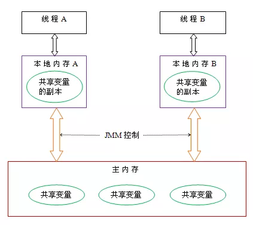

从上图来看，线程A与线程B之间如要通信的话，必须要经历下面2个步骤：

* 1.首先，线程A把本地内存A中更新过的共享变量刷新到主内存中去。
* 2.然后，线程B到主内存中去读取线程A之前已更新过的共享变量。

下面通过示意图来说明这两个步骤：

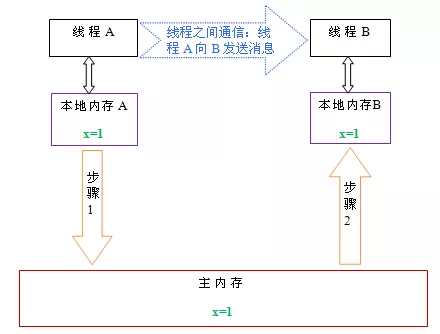

   如上图所示，本地内存A和B有主内存中共享变量x的副本。假设初始时，这三个内存中的x值都为0。线程A在执行时，把更新后的x值（假设值为1）临时存放在自己的本地内存A中。当线程A和线程B需要通信时，线程A首先会把自己本地内存中修改后的x值刷新到主内存中，此时主内存中的x值变为了1。随后，线程B到主内存中去读取线程A更新后的x值，此时线程B的本地内存的x值也变为了1。
   
   从整体来看，这两个步骤实质上是线程A在向线程B发送消息，而且这个通信过程必须要经过主内存。JMM通过控制主内存与每个线程的本地内存之间的交互，来为java程序员提供内存可见性保证。
   

### 3.重排序

在执行程序时为了提高性能，编译器和处理器常常会对指令做重排序。重排序分三种类型：

* 1.编译器优化的重排序。编译器在不改变单线程程序语义的前提下，可以重新安排语句的执行顺序。

* 2.指令级并行的重排序。现代处理器采用了指令级并行技术（Instruction-Level Parallelism， ILP）来将多条指令重叠执行。如果不存在数据依赖性，处理器可以改变语句对应机器指令的执行顺序。

* 3.内存系统的重排序。由于处理器使用缓存和读/写缓冲区，这使得加载和存储操作看上去可能是在乱序执行。

从java源代码到最终实际执行的指令序列，会分别经历下面三种重排序：


   上述的1属于编译器重排序，2和3属于处理器重排序。这些重排序都可能会导致多线程程序出现内存可见性问题。对于编译器，JMM的编译器重排序规则会禁止特定类型的编译器重排序（不是所有的编译器重排序都要禁止）。对于处理器重排序，JMM的处理器重排序规则会要求java编译器在生成指令序列时，插入特定类型的内存屏障（memory barriers，intel称之为memory fence）指令，通过内存屏障指令来禁止特定类型的处理器重排序（不是所有的处理器重排序都要禁止）。

   JMM属于语言级的内存模型，它确保在不同的编译器和不同的处理器平台之上，通过禁止特定类型的编译器重排序和处理器重排序，为程序员提供一致的内存可见性保证。
   
### 4.处理器重排序与内存屏障指令 
   现代的处理器使用写缓冲区来临时保存向内存写入的数据。写缓冲区可以保证指令流水线持续运行，它可以避免由于处理器停顿下来等待向内存写入数据而产生的延迟。同时，通过以批处理的方式刷新写缓冲区，以及合并写缓冲区中对同一内存地址的多次写，可以减少对内存总线的占用。虽然写缓冲区有这么多好处，但每个处理器上的写缓冲区，仅仅对它所在的处理器可见。这个特性会对内存操作的执行顺序产生重要的影响：处理器对内存的读/写操作的执行顺序，不一定与内存实际发生的读/写操作顺序一致！

### 5.happens-before

   从JDK5开始，java使用新的JSR -133内存模型（本文除非特别说明，针对的都是JSR- 133内存模型）。JSR-133提出了happens-before的概念，通过这个概念来阐述操作之间的内存可见性。如果一个操作执行的结果需要对另一个操作可见，那么这两个操作之间必须存在happens-before关系。这里提到的两个操作既可以是在一个线程之内，也可以是在不同线程之间。 与程序员密切相关的happens-before规则如下：
   
   * 程序顺序规则：一个线程中的每个操作，happens- before 于该线程中的任意后续操作。
   * 监视器锁规则：对一个监视器锁的解锁，happens- before 于随后对这个监视器锁的加锁。  
   * volatile变量规则：对一个volatile域的写，happens- before 于任意后续对这个volatile域的读。
   * 传递性：如果A happens- before B，且B happens- before C，那么A happens- before C。

   注意，两个操作之间具有happens-before关系，并不意味着前一个操作必须要在后一个操作之前执行！happens-before仅仅要求前一个操作（执行的结果）对后一个操作可见，且前一个操作按顺序排在第二个操作之前（the first is visible to and ordered before the second）。happens- before的定义很微妙，后文会具体说明happens-before为什么要这么定义。
   
   happens-before与JMM的关系如下图所示：
   
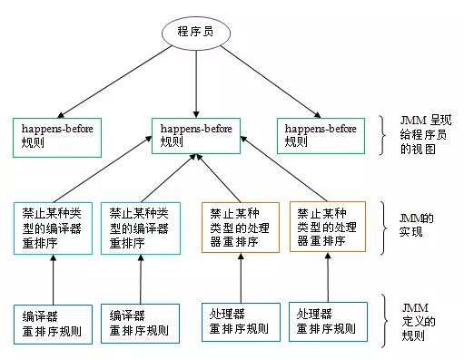

   如上图所示，一个happens-before规则通常对应于多个编译器重排序规则和处理器重排序规则。对于java程序员来说，happens-before规则简单易懂，它避免程序员为了理解JMM提供的内存可见性保证而去学习复杂的重排序规则以及这些规则的具体实现。


## [二.Java内存模型-重排序](https://mp.weixin.qq.com/s?__biz=MzA4NDc2MDQ1Nw==&mid=2650238627&idx=1&sn=b893f12a765bbddee41ed7826837dbaf&chksm=87e18c45b096055375eca4f187d5b0763cf6cad6ccd30d7c1fc8a8c9ef7879a942456c95b452&scene=21#wechat_redirect)

### 1.数据依赖性

   如果两个操作访问同一个变量，且这两个操作中有一个为写操作，此时这两个操作之间就存在数据依赖性。数据依赖分下列三种类型：
   
* 1.写后读,a = 1;b = a;写一个变量之后，再读这个位置。
* 2.写后写,a = 1;a = 2;写一个变量之后，再写这个变量。
* 3.读后写.a = b;b = 1;读一个变量之后，再写这个变量。

   上面三种情况，只要重排序两个操作的执行顺序，程序的执行结果将会被改变。

   前面提到过，编译器和处理器可能会对操作做重排序。编译器和处理器在重排序时，会遵守数据依赖性，编译器和处理器不会改变存在数据依赖关系的两个操作的执行顺序。

   注意，这里所说的数据依赖性仅针对单个处理器中执行的指令序列和单个线程中执行的操作，不同处理器之间和不同线程之间的数据依赖性不被编译器和处理器考虑。


### 2.as-if-serial语义

   as-if-serial语义的意思指：不管怎么重排序（编译器和处理器为了提高并行度），（单线程）程序的执行结果不能被改变。编译器，runtime 和处理器都必须遵守as-if-serial语义。
   
   为了遵守as-if-serial语义，编译器和处理器不会对存在数据依赖关系的操作做重排序，因为这种重排序会改变执行结果。但是，如果操作之间不存在数据依赖关系，这些操作可能被编译器和处理器重排序。为了具体说明，请看下面计算圆面积的代码示例：
   
```
double pi  = 3.14;    //A
double r   = 1.0;     //B
double area = pi * r * r; //C

```
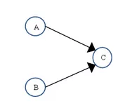

   如上图所示，A和C之间存在数据依赖关系，同时B和C之间也存在数据依赖关系。因此在最终执行的指令序列中，C不能被重排序到A和B的前面（C排到A和B的前面，程序的结果将会被改变）。但A和B之间没有数据依赖关系，编译器和处理器可以重排序A和B之间的执行顺序。下图是该程序的两种执行顺序：
   
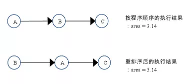

   as-if-serial语义把单线程程序保护了起来，遵守as-if-serial语义的编译器，runtime 和处理器共同为编写单线程程序的程序员创建了一个幻觉：单线程程序是按程序的顺序来执行的。as-if-serial语义使单线程程序员无需担心重排序会干扰他们，也无需担心内存可见性问题。
   

### 3.程序顺序规则

   根据happens- before的程序顺序规则，上面计算圆的面积的示例代码存在三个happens- before关系：

* A happens- before B；
* B happens- before C；
* A happens- before C；

   这里的第3个happens- before关系，是根据happens- before的传递性推导出来的。

   这里A happens- before B，但实际执行时B却可以排在A之前执行（看上面的重排序后的执行顺序）。在第一章提到过，如果A happens- before B，JMM并不要求A一定要在B之前执行。JMM仅仅要求前一个操作（执行的结果）对后一个操作可见，且前一个操作按顺序排在第二个操作之前。这里操作A的执行结果不需要对操作B可见；而且重排序操作A和操作B后的执行结果，与操作A和操作B按happens- before顺序执行的结果一致。在这种情况下，JMM会认为这种重排序并不非法（not illegal），JMM允许这种重排序。
   
   在计算机中，软件技术和硬件技术有一个共同的目标：在不改变程序执行结果的前提下，尽可能的开发并行度。编译器和处理器遵从这一目标，从happens- before的定义我们可以看出，JMM同样遵从这一目标。
   
### 4.重排序对多线程的影响

   现在让我们来看看，重排序是否会改变多线程程序的执行结果。请看下面的示例代码：

```java

class ReorderExample {
    int a = 0;
    boolean flag = false;
    public void writer() {
        a = 1;                   //1
        flag = true;             //2
    }
    public void reader() {
        if (flag) {                //3
            int i =  a * a;        //4
        }
    }
}
```
   flag变量是个标记，用来标识变量a是否已被写入。这里假设有两个线程A和B，A首先执行writer()方法，随后B线程接着执行reader()方法。线程B在执行操作4时，能否看到线程A在操作1对共享变量a的写入？

   答案是：不一定能看到。
   
   由于操作1和操作2没有数据依赖关系，编译器和处理器可以对这两个操作重排序；同样，操作3和操作4没有数据依赖关系，编译器和处理器也可以对这两个操作重排序。让我们先来看看，当操作1和操作2重排序时，可能会产生什么效果？请看下面的程序执行时序图：
   
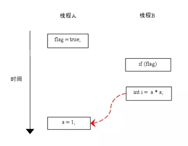
   
   如上图所示，操作1和操作2做了重排序。程序执行时，线程A首先写标记变量flag，随后线程B读这个变量。由于条件判断为真，线程B将读取变量a。此时，变量a还根本没有被线程A写入，在这里多线程程序的语义被重排序破坏了！
   
   ※注：本文统一用红色的虚箭线表示错误的读操作，用绿色的虚箭线表示正确的读操作。
   
   下面再让我们看看，当操作3和操作4重排序时会产生什么效果（借助这个重排序，可以顺便说明控制依赖性）。下面是操作3和操作4重排序后，程序的执行时序图：
   
   
   
   在程序中，操作3和操作4存在控制依赖关系。当代码中存在控制依赖性时，会影响指令序列执行的并行度。为此，编译器和处理器会采用猜测（Speculation）执行来克服控制相关性对并行度的影响。以处理器的猜测执行为例，执行线程B的处理器可以提前读取并计算a*a，然后把计算结果临时保存到一个名为重排序缓冲（reorder buffer ROB）的硬件缓存中。当接下来操作3的条件判断为真时，就把该计算结果写入变量i中。
   
   从图中我们可以看出，猜测执行实质上对操作3和4做了重排序。重排序在这里破坏了多线程程序的语义！
   
   在单线程程序中，对存在控制依赖的操作重排序，不会改变执行结果（这也是as-if-serial语义允许对存在控制依赖的操作做重排序的原因）；但在多线程程序中，对存在控制依赖的操作重排序，可能会改变程序的执行结果。


## [三.Java内存模型-顺序一致性](https://mp.weixin.qq.com/s?__biz=MzA4NDc2MDQ1Nw==&mid=2650238628&idx=1&sn=43b6a33f5afa84e2488b6e8933969d96&chksm=87e18c42b0960554d91ff8364dc409ded6b75fda7c9a05109680d7d5cce914a25f1e02894315&scene=21#wechat_redirect)

### 1.数据竞争与顺序一致性保证

   当程序未正确同步时，就会存在数据竞争。java内存模型规范对数据竞争的定义如下：

* 在一个线程中写一个变量，
* 在另一个线程读同一个变量，
* 而且写和读没有通过同步来排序。

   当代码中包含数据竞争时，程序的执行往往产生违反直觉的结果（前一章的示例正是如此）。如果一个多线程程序能正确同步，这个程序将是一个没有数据竞争的程序。
   
   JMM对正确同步的多线程程序的内存一致性做了如下保证：

   如果程序是正确同步的，程序的执行将具有顺序一致性（sequentially consistent）--即程序的执行结果与该程序在顺序一致性内存模型中的执行结果相同（马上我们将会看到，这对于程序员来说是一个极强的保证）。这里的同步是指广义上的同步，包括对常用同步原语（lock，volatile和final）的正确使用。
   
   
### 2.顺序一致性内存模型

   顺序一致性内存模型是一个被计算机科学家理想化了的理论参考模型，它为程序员提供了极强的内存可见性保证。顺序一致性内存模型有两大特性：
   
   一个线程中的所有操作必须按照程序的顺序来执行。
   
   所有线程（不管程序是否同步）都只能看到一个单一的操作执行顺序。在顺序一致性内存模型中，每个操作都必须原子执行且立刻对所有线程可见。
   
   在概念上，顺序一致性模型有一个单一的全局内存，这个内存通过一个左右摆动的开关可以连接到任意一个线程。同时，每一个线程必须按程序的顺序来执行内存读/写操作。从上图我们可以看出，在任意时间点最多只能有一个线程可以连接到内存。当多个线程并发执行时，图中的开关装置能把所有线程的所有内存读/写操作串行化。

   为了更好的理解，下面我们通过两个示意图来对顺序一致性模型的特性做进一步的说明。

   假设有两个线程A和B并发执行。其中A线程有三个操作，它们在程序中的顺序是：A1->A2->A3。B线程也有三个操作，它们在程序中的顺序是：B1->B2->B3。

   假设这两个线程使用监视器来正确同步：A线程的三个操作执行后释放监视器，随后B线程获取同一个监视器。那么程序在顺序一致性模型中的执行效果将如下图所示：
 
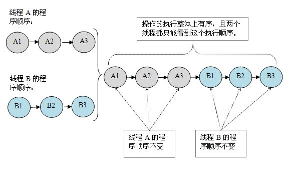
 
   现在我们再假设这两个线程没有做同步，下面是这个未同步程序在顺序一致性模型中的执行示意图：
  


   未同步程序在顺序一致性模型中虽然整体执行顺序是无序的，但所有线程都只能看到一个一致的整体执行顺序。以上图为例，线程A和B看到的执行顺序都是：B1->A1->A2->B2->A3->B3。之所以能得到这个保证是因为顺序一致性内存模型中的每个操作必须立即对任意线程可见。
   
   但是，在JMM中就没有这个保证。未同步程序在JMM中不但整体的执行顺序是无序的，而且所有线程看到的操作执行顺序也可能不一致。比如，在当前线程把写过的数据缓存在本地内存中，且还没有刷新到主内存之前，这个写操作仅对当前线程可见；从其他线程的角度来观察，会认为这个写操作根本还没有被当前线程执行。只有当前线程把本地内存中写过的数据刷新到主内存之后，这个写操作才能对其他线程可见。在这种情况下，当前线程和其它线程看到的操作执行顺序将不一致。
 
 ### 3.同步程序的顺序一致性效果
 
   下面我们对前面的示例程序ReorderExample用监视器来同步，看看正确同步的程序如何具有顺序一致性。
 
 请看下面的示例代码：
 ```java
class SynchronizedExample {
    int a = 0;
    boolean flag = false;
    public synchronized void writer() {
        a = 1;
        flag = true;
    }
    public synchronized void reader() {
        if (flag) {
            int i = a;
        }
    }
}
```
   上面示例代码中，假设A线程执行writer()方法后，B线程执行reader()方法。这是一个正确同步的多线程程序。根据JMM规范，该程序的执行结果将与该程序在顺序一致性模型中的执行结果相同。下面是该程序在两个内存模型中的执行时序对比图：

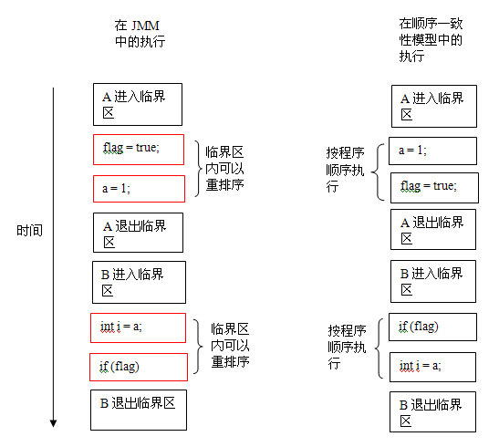

   在顺序一致性模型中，所有操作完全按程序的顺序串行执行。而在JMM中，临界区内的代码可以重排序（但JMM不允许临界区内的代码“逸出”到临界区之外，那样会破坏监视器的语义）。JMM会在退出监视器和进入监视器这两个关键时间点做一些特别处理，使得线程在这两个时间点具有与顺序一致性模型相同的内存视图（具体细节后文会说明）。虽然线程A在临界区内做了重排序，但由于监视器的互斥执行的特性，这里的线程B根本无法“观察”到线程A在临界区内的重排序。这种重排序既提高了执行效率，又没有改变程序的执行结果。
   
   从这里我们可以看到JMM在具体实现上的基本方针：在不改变（正确同步的）程序执行结果的前提下，尽可能的为编译器和处理器的优化打开方便之门。
   
   
### 4.未同步程序的执行特性

   对于未同步或未正确同步的多线程程序，JMM只提供最小安全性：线程执行时读取到的值，要么是之前某个线程写入的值，要么是默认值（0，null，false），JMM保证线程读操作读取到的值不会无中生有（out of thin air）的冒出来。为了实现最小安全性，JVM在堆上分配对象时，首先会清零内存空间，然后才会在上面分配对象（JVM内部会同步这两个操作）。因此，在以清零的内存空间（pre-zeroed memory）分配对象时，域的默认初始化已经完成了。
   
   JMM不保证未同步程序的执行结果与该程序在顺序一致性模型中的执行结果一致。因为未同步程序在顺序一致性模型中执行时，整体上是无序的，其执行结果无法预知。保证未同步程序在两个模型中的执行结果一致毫无意义。
   
   和顺序一致性模型一样，未同步程序在JMM中的执行时，整体上也是无序的，其执行结果也无法预知。同时，未同步程序在这两个模型中的执行特性有下面几个差异：
   
   * 1.顺序一致性模型保证单线程内的操作会按程序的顺序执行，而JMM不保证单线程内的操作会按程序的顺序执行（比如上面正确同步的多线程程序在临界区内的重排序）。这一点前面已经讲过了，这里就不再赘述。
   
   * 2.顺序一致性模型保证所有线程只能看到一致的操作执行顺序，而JMM不保证所有线程能看到一致的操作执行顺序。这一点前面也已经讲过，这里就不再赘述。
   
   * 3.JMM不保证对64位的long型和double型变量的读/写操作具有原子性，而顺序一致性模型保证对所有的内存读/写操作都具有原子性。
   
   第3个差异与处理器总线的工作机制密切相关。在计算机中，数据通过总线在处理器和内存之间传递。每次处理器和内存之间的数据传递都是通过一系列步骤来完成的，这一系列步骤称之为总线事务（bus transaction）。总线事务包括读事务（read transaction）和写事务（write transaction）。读事务从内存传送数据到处理器，写事务从处理器传送数据到内存，每个事务会读/写内存中一个或多个物理上连续的字。这里的关键是，总线会同步试图并发使用总线的事务。在一个处理器执行总线事务期间，总线会禁止其它所有的处理器和I/O设备执行内存的读/写。下面让我们通过一个示意图来说明总线的工作机制：
   
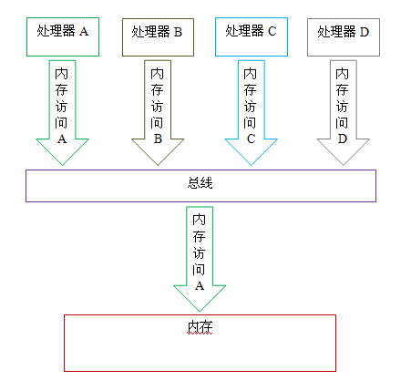
   
   如上图所示，假设处理器A，B和C同时向总线发起总线事务，这时总线仲裁（bus arbitration）会对竞争作出裁决，这里我们假设总线在仲裁后判定处理器A在竞争中获胜（总线仲裁会确保所有处理器都能公平的访问内存）。此时处理器A继续它的总线事务，而其它两个处理器则要等待处理器A的总线事务完成后才能开始再次执行内存访问。假设在处理器A执行总线事务期间（不管这个总线事务是读事务还是写事务），处理器D向总线发起了总线事务，此时处理器D的这个请求会被总线禁止。
   
   总线的这些工作机制可以把所有处理器对内存的访问以串行化的方式来执行；在任意时间点，最多只能有一个处理器能访问内存。这个特性确保了单个总线事务之中的内存读/写操作具有原子性。
   
   在一些32位的处理器上，如果要求对64位数据的读/写操作具有原子性，会有比较大的开销。为了照顾这种处理器，java语言规范鼓励但不强求JVM对64位的long型变量和double型变量的读/写具有原子性。当JVM在这种处理器上运行时，会把一个64位long/ double型变量的读/写操作拆分为两个32位的读/写操作来执行。这两个32位的读/写操作可能会被分配到不同的总线事务中执行，此时对这个64位变量的读/写将不具有原子性。
   
   当单个内存操作不具有原子性，将可能会产生意想不到后果。请看下面示意图：
   
 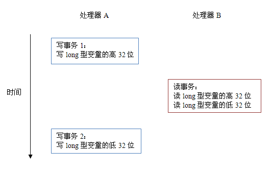

   
   如上图所示，假设处理器A写一个long型变量，同时处理器B要读这个long型变量。处理器A中64位的写操作被拆分为两个32位的写操作，且这两个32位的写操作被分配到不同的写事务中执行。同时处理器B中64位的读操作被拆分为两个32位的读操作，且这两个32位的读操作被分配到同一个的读事务中执行。当处理器A和B按上图的时序来执行时，处理器B将看到仅仅被处理器A“写了一半“的无效值。
   
   

## [四.Java内存模型-volatile](https://mp.weixin.qq.com/s?__biz=MzA4NDc2MDQ1Nw==&mid=2650238633&idx=1&sn=32dc2c72d6e7141f621ba3f4a0fe3da0&chksm=87e18c4fb09605597f1cb3d12890ae382a2b9c7e7e9c05422cb4c1c41ff78a6da98076d110ab&scene=21#wechat_redirect)

### 1.volatile的特性

   当我们声明共享变量为volatile后，对这个变量的读/写将会很特别。理解volatile特性的一个好方法是：把对volatile变量的单个读/写，看成是使用同一个监视器锁对这些单个读/写操作做了同步。下面我们通过具体的示例来说明，请看下面的示例代码：
   
```java
class VolatileFeaturesExample {
    volatile long vl = 0L;  //使用volatile声明64位的long型变量
    public void set(long l) {
        vl = l;   //单个volatile变量的写
    }
    public void getAndIncrement () {
        vl++;    //复合（多个）volatile变量的读/写
    }
    public long get() {
        return vl;   //单个volatile变量的读
    }
}
```

   假设有多个线程分别调用上面程序的三个方法，这个程序在语意上和下面程序等价：
   
```java
class VolatileFeaturesExample {
    long vl = 0L;               // 64位的long型普通变量
    public synchronized void set(long l) {     //对单个的普通 变量的写用同一个监视器同步
        vl = l;
    }
    public void getAndIncrement () { //普通方法调用
        long temp = get();           //调用已同步的读方法
        temp += 1L;                  //普通写操作
        set(temp);                   //调用已同步的写方法
    }
    public synchronized long get() { 
    //对单个的普通变量的读用同一个监视器同步
        return vl;
    }
}
```
   如上面示例程序所示，对一个volatile变量的单个读/写操作，与对一个普通变量的读/写操作使用同一个监视器锁来同步，它们之间的执行效果相同。
   
   监视器锁的happens-before规则保证释放监视器和获取监视器的两个线程之间的内存可见性，这意味着对一个volatile变量的读，总是能看到（任意线程）对这个volatile变量最后的写入。
   
   监视器锁的语义决定了临界区代码的执行具有原子性。这意味着即使是64位的long型和double型变量，只要它是volatile变量，对该变量的读写就将具有原子性。如果是多个volatile操作或类似于volatile++这种复合操作，这些操作整体上不具有原子性。
   
   简而言之，volatile变量自身具有下列特性：
   
   * 可见性。对一个volatile变量的读，总是能看到（任意线程）对这个volatile变量最后的写入。
   * 原子性：对任意单个volatile变量的读/写具有原子性，但类似于volatile++这种复合操作不具有原子性。


### 2.volatile写-读建立的happens before关系

   上面讲的是volatile变量自身的特性，对程序员来说，volatile对线程的内存可见性的影响比volatile自身的特性更为重要，也更需要我们去关注。
   从JSR-133开始，volatile变量的写-读可以实现线程之间的通信。
   从内存语义的角度来说，volatile与监视器锁有相同的效果：volatile写和监视器的释放有相同的内存语义；volatile读与监视器的获取有相同的内存语义。
   请看下面使用volatile变量的示例代码：
```java
class VolatileExample {
    int a = 0;
    volatile boolean flag = false;
    public void writer() {
        a = 1;                   //1
        flag = true;               //2
    }
    public void reader() {
        if (flag) {                //3
            int i =  a;           //4
        }
    }
}
```   
   假设线程A执行writer()方法之后，线程B执行reader()方法。根据happens before规则，这个过程建立的happens before 关系可以分为两类：

* 根据程序次序规则，1 happens before 2; 3 happens before 4。
* 根据volatile规则，2 happens before 3。
* 根据happens before 的传递性规则，1 happens before 4。

   上述happens before 关系的图形化表现形式如下：
   在上图中，每一个箭头链接的两个节点，代表了一个happens before 关系。黑色箭头表示程序顺序规则；橙色箭头表示volatile规则；蓝色箭头表示组合这些规则后提供的happens before保证。

   这里A线程写一个volatile变量后，B线程读同一个volatile变量。A线程在写volatile变量之前所有可见的共享变量，在B线程读同一个volatile变量后，将立即变得对B线程可见。
   
### 3.volatile写-读的内存语义
   
   volatile写的内存语义如下：

   当写一个volatile变量时，JMM会把该线程对应的本地内存中的共享变量刷新到主内存。

   以上面示例程序VolatileExample为例，假设线程A首先执行writer()方法，随后线程B执行reader()方法，初始时两个线程的本地内存中的flag和a都是初始状态。下图是线程A执行volatile写后，共享变量的状态示意图：
   
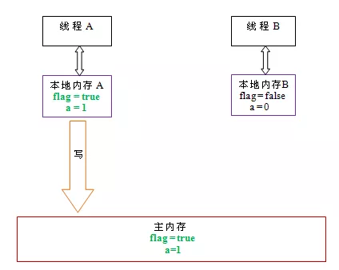
   
   如上图所示，线程A在写flag变量后，本地内存A中被线程A更新过的两个共享变量的值被刷新到主内存中。此时，本地内存A和主内存中的共享变量的值是一致的。
   
   volatile读的内存语义如下：
   
   * 当读一个volatile变量时，JMM会把该线程对应的本地内存置为无效。线程接下来将从主内存中读取共享变量。
   
   下面是线程B读同一个volatile变量后，共享变量的状态示意图：
   


   如上图所示，在读flag变量后，本地内存B已经被置为无效。此时，线程B必须从主内存中读取共享变量。线程B的读取操作将导致本地内存B与主内存中的共享变量的值也变成一致的了。
   
   如果我们把volatile写和volatile读这两个步骤综合起来看的话，在读线程B读一个volatile变量后，写线程A在写这个volatile变量之前所有可见的共享变量的值都将立即变得对读线程B可见。
   
   下面对volatile写和volatile读的内存语义做个总结：
   
   * 线程A写一个volatile变量，实质上是线程A向接下来将要读这个volatile变量的某个线程发出了（其对共享变量所在修改的）消息。
   
   * 线程B读一个volatile变量，实质上是线程B接收了之前某个线程发出的（在写这个volatile变量之前对共享变量所做修改的）消息。
   
   * 线程A写一个volatile变量，随后线程B读这个volatile变量，这个过程实质上是线程A通过主内存向线程B发送消息。
   
### 4.volatile内存语义的实现
略.

### 5.JSR-133为什么要增强volatile的内存语义

   在JSR-133之前的旧Java内存模型中，虽然不允许volatile变量之间重排序，但旧的Java内存模型允许volatile变量与普通变量之间重排序。在旧的内存模型中，VolatileExample示例程序可能被重排序成下列时序来执行：
 
 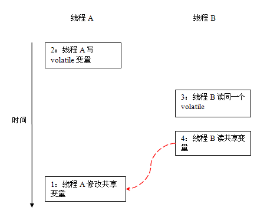
 
   在旧的内存模型中，当1和2之间没有数据依赖关系时，1和2之间就可能被重排序（3和4类似）。其结果就是：读线程B执行4时，不一定能看到写线程A在执行1时对共享变量的修改。
   
   因此在旧的内存模型中 ，volatile的写-读没有监视器的释放-获所具有的内存语义。为了提供一种比监视器锁更轻量级的线程之间通信的机制，JSR-133专家组决定增强volatile的内存语义：严格限制编译器和处理器对volatile变量与普通变量的重排序，确保volatile的写-读和监视器的释放-获取一样，具有相同的内存语义。从编译器重排序规则和处理器内存屏障插入策略来看，只要volatile变量与普通变量之间的重排序可能会破坏volatile的内存语意，这种重排序就会被编译器重排序规则和处理器内存屏障插入策略禁止。
   
   由于volatile仅仅保证对单个volatile变量的读/写具有原子性，而监视器锁的互斥执行的特性可以确保对整个临界区代码的执行具有原子性。在功能上，监视器锁比volatile更强大；在可伸缩性和执行性能上，volatile更有优势。如果读者想在程序中用volatile代替监视器锁，请一定谨慎。
   


## 拓展阅读
1.[Java并发](https://github.com/CyC2018/CS-Notes/blob/master/notes/Java%20%E5%B9%B6%E5%8F%91.md)